class: middle, center,  black-slide,  title-slide

background-image: url(./figures/pic/voice-wave.gif)
background-size: cover


<br>
.larger-x.title[Метод глибинного машинного навчання для ідентифікації, класифікації та семантичної сегментації об’єктів] 

.smaller-x[Результати дисертаційного дослідження на здобуття наукового ступеня]<br>
Доктор фiлософії


<br><br><br><br>
.larger-x[Кочура Юрій Петрович]<br><br>
.left[Науковий керiвник<br>
.bold[Гордієнко Юрій Григорович], д-р. фiз.-мат. наук, проф.]  <br>


 2026

???
Скорочення: https://bati.nubip.edu.ua/index.php/ua/activityfooter/vimogi-do-skorochennya-nazv-naukovikh-stupeniv.html

<!-- .left[Наукові керiвники<br>
.bold[Гордієнко Юрій Григорович], д-р. фiз.-мат. наук, проф. <br>
.bold[Стiренко Сергiй Григорович], д-р. тех. наук, проф.] --> 

---

exclude: true
class:  black-slide, middle

.grid[
.kol-1-2[ 
.circle.center.width-80[]
.bold.center[👤 Кочура Юрій Петрович ] 
<span style="display:block; margin:10px 0;"></span>
.bold.center[🏢 Кафедра ОТ, ФІОТ]]
.kol-1-2[ 
.circle.center.width-75[]
.bold.center[👤 Гордієнко Юрій Григорович] 
<span style="display:block; margin:10px 0;"></span>
.bold.center[🎓 Доктор фіз.-мат. наук, професор]
<span style="display:block; margin:10px 0;"></span>
.bold.center[🏢 Кафедра ОТ, ФІОТ]
]]

---

class:  black-slide,
background-image: url("https://www.dropbox.com/scl/fi/ples3jkjtxpmh7j9l81w9/vecteezy-2.gif?rlkey=bfzhdgfcegdavmgl5dnnfdgof&st=1n6pcl3y&dl=1")
background-size: cover

# Зміст

.larger-x[ <p class="shadow" style="line-height: 180%;"> 

  1. Публікації за темою дисертації<br>
  2. Актуальність теми <br>
  3. Мета і задачі дослідження <br>
  4. Наукові положення, що виносяться на захист<br>
  5. Об’єкт і предмет дослідження <br>
  6. Апробація результатів дисертації <br>
  7. Зв'язок з науковими програмами <br>
  8. Переваги та недолiки iснуючих методiв <br>
  9. Розроблені та вдосконалені методи глибинного навчання <br>
  10. Аналіз і обговорення отриманих результатів <br>
  11. Висновки <br>    
</p>]

---


class: blue-slide, middle, center
count: false

.larger-xx[Публікації за темою дисертації]

---

class: black-slide, middle

.larger-xm.success[Основні результати за темою дисертації були висвітлені в .bold[22] наукових працях, які розкривають основний зміст дисертації, зокрема у 16 наукових статтях, з яких:
- 1 стаття у закордонному фаховому виданні першого квартиля (Q1), 
- 7 статей у закордонних фахових виданнях третього квартиля (Q3), 
- 6 статей у закордонних фахових виданнях четвертого квартиля (Q4)
- 1 стаття у фаховому виданні України категорії Б,
- 1 стаття у періодичному закордонному фаховому виданні, яке індексується у Scopus, без квартильного рейтингу,

а також у 6 матеріалах науково-технічних конференцій. Із 22 наукових праць 21 опубліковано у закордонних виданнях, які проіндексовані у базі даних Scopus.]

---

class: black-slide, middle, 

# Публікації

.smaller-x[
.pub-list[
.pub-item[
.pub-year[1.]
.pub-content[
.pub-title[Generative Data Augmentation by Dataset Distillation.]
.pub-authors[Gordienko, Y., Nowakowski, G., Kochura, Y., Taran, V., & Stirenko, S.]
.pub-venue[Communications in Computer and Information Science, 2026, vol. 2696, pp. 105–118.]
.pub-meta[.pub-doi[[10.1007/978-3-032-17216-7_9](https://doi.org/10.1007/978-3-032-17216-7_9)] .pub-issn[1865-0929] .pub-scopus[Scopus] .pub-q4[Q4]]
]
]

.pub-item[
.pub-year[2.]
.pub-content[
.pub-title[Multi-Backbone Ensembling for Performance Improvement in Federated Learning Setup.]
.pub-authors[Gordienko, Y., Gordienko, N., El Mhamdi, E. M., Kochura, Y., & Stirenko, S.]
.pub-venue[Lecture Notes in Networks and Systems, 2026, vol. 1598, pp. 129–138.]
.pub-meta[.pub-doi[[10.1007/978-3-032-04160-9_12](https://doi.org/10.1007/978-3-032-04160-9_12)] .pub-issn[2367-3370] .pub-scopus[Scopus] .pub-q4[Q4]]
]
]

.pub-item[
.pub-year[3.]
.pub-content[
.pub-title[UAeroNet: Domain-Specific Dataset for Automation of Unmanned Aerial Vehicles.]
.pub-authors[Kochura, Y., Trochun, Y., Taran, V., Gordienko, Y., Rokovyi, O., & Stirenko, S.]
.pub-venue[Information, Computing and Intelligent Systems, no. 7, pp. 83–95, 2025.]
.pub-meta[.pub-doi[[10.20535/2786-8729.7.2025.341779](https://doi.org/10.20535/2786-8729.7.2025.341779)] .pub-issn[2786-8729] .pub-scopus[Фахове видання України] .pub-q4[Б]]
]
]

.pub-item[
.pub-year[4.]
.pub-content[
.pub-title[Multimodal Metadata Augmentation for Federated Learning in Medical Applications.]
.pub-authors[Gordienko, Y., Shulha, M., Kochura, Y., Rokovyi, O., Taran, V., Alienin, O., & Stirenko, S.]
.pub-venue[Lecture Notes in Networks and Systems, 2024, vol. 1002, pp. 537–547.]
.pub-meta[.pub-doi[[10.1007/978-981-97-3299-9_43](https://doi.org/10.1007/978-981-97-3299-9_43)] .pub-issn[2367-3370] .pub-scopus[Scopus] .pub-q4[Q4]]
]
]

]
]

---

class: black-slide, middle,

# Публікації

.smaller-x[
.pub-list[
.pub-item[
.pub-year[5.]
.pub-content[
.pub-title[Ensemble Knowledge Distillation for Edge Intelligence in Medical Applications.]
.pub-authors[Gordienko, Y., Shulha, M., Kochura, Y., Rokovyi, O., Alienin, O., Taran, V., & Stirenko, S.]
.pub-venue[Studies in Computational Intelligence, 2023, vol. 1100, pp. 135–168.]
.pub-meta[.pub-doi[[10.1007/978-3-031-32095-8_5](https://doi.org/10.1007/978-3-031-32095-8_5)] .pub-issn[1860-949X] .pub-scopus[Scopus] .pub-q4[Q4]]
]
]

.pub-item[
.pub-year[6.]
.pub-content[
.pub-title[Fuzzy Metadata Augmentation for Multimodal Data Classification.]
.pub-authors[Gordienko, Y., Shulha, M., Kochura, Y., Rokovyi, O., Alienin, O., & Stirenko, S.]
.pub-venue[Lecture Notes on Data Engineering and Communications Technologies, 2023, vol. 166, pp. 157–172.]
.pub-meta[.pub-doi[[10.1007/978-981-99-0835-6_11](https://doi.org/10.1007/978-981-99-0835-6_11)] .pub-issn[2367-4512] .pub-scopus[Scopus] .pub-q3[Q3]]
]
]

.pub-item[
.pub-year[7.]
.pub-content[
.pub-title[Edge Intelligence for Medical Applications Under Field Conditions.]
.pub-authors[Taran, V., Gordienko, Y., Rokovyi, O., Alienin, O., Kochura, Y., & Stirenko, S.]
.pub-venue[Lecture Notes on Data Engineering and Communications Technologies, 2022, vol. 135, pp. 71–80.]
.pub-meta[.pub-doi[[10.1007/978-3-031-04809-8_6](https://doi.org/10.1007/978-3-031-04809-8_6)] .pub-issn[2367-4512] .pub-scopus[Scopus] .pub-q3[Q3]]
]
]

.pub-item[
.pub-year[8.]
.pub-content[
.pub-title[Artificial Intelligence Platform for Distant Computer-Aided Detection (CADe) and Computer-Aided Diagnosis (CADx) of Human Diseases.]
.pub-authors[Alienin, O., Rokovyi, O., Gordienko, Y., Kochura, Y., Taran, V., & Stirenko, S.]
.pub-venue[Lecture Notes on Data Engineering and Communications Technologies, 2022, vol. 135, pp. 91–100.]
.pub-meta[.pub-doi[[10.1007/978-3-031-04809-8_8](https://doi.org/10.1007/978-3-031-04809-8_8)] .pub-issn[2367-4512] .pub-scopus[Scopus] .pub-q3[Q3]]
]
]
]
]

---

class: black-slide, middle,

# Публікації

.smaller-xm[
.pub-list[
.pub-item[
.pub-year[9.]
.pub-content[
.pub-title[Deep Learning for Melanoma Detection with Testing Time Data Augmentation.]
.pub-authors[Doms, V., Gordienko, Y., Kochura, Y., Rokovyi, O., Alienin, O., & Stirenko, S.]
.pub-venue[Lecture Notes on Data Engineering and Communications Technologies, 2021, vol. 82, pp. 131–140.]
.pub-meta[.pub-doi[[10.1007/978-3-030-80475-6_13](https://doi.org/10.1007/978-3-030-80475-6_13)] .pub-issn[2367-4512] .pub-scopus[Scopus]]
]
]

.pub-item[
.pub-year[10.]
.pub-content[
.pub-title["Last Mile" Optimization of Edge Computing Ecosystem with Deep Learning Models and Specialized Tensor Processing Architectures.]
.pub-authors[Gordienko, Y., Kochura, Y., Taran, V., Gordienko, N., Rokovyi, O., Alienin, O., & Stirenko, S.]
.pub-venue[Advances in Computers, 2021, vol. 122, pp. 303–341.]
.pub-meta[.pub-doi[[10.1016/bs.adcom.2020.10.003](https://doi.org/10.1016/bs.adcom.2020.10.003)] .pub-issn[0065-2458] .pub-scopus[Scopus] .pub-q1[Q1]]
]
]

.pub-item[
.pub-year[11.]
.pub-content[
.pub-title[Scaling Analysis of Specialized Tensor Processing Architectures for Deep Learning Models.]
.pub-authors[Gordienko, Y., Kochura, Y., Taran, V., Gordienko, N., Rokovyi, A., Alienin, O., & Stirenko, S.]
.pub-venue[Studies in Computational Intelligence, 2020, vol. 866, pp. 65–99.]
.pub-meta[.pub-doi[[10.1007/978-3-030-31756-0_3](https://doi.org/10.1007/978-3-030-31756-0_3)] .pub-issn[1860-949X] .pub-scopus[Scopus] .pub-q4[Q4]]
]
]

.pub-item[
.pub-year[12.]
.pub-content[
.pub-title[Effect of Data Augmentation and Lung Mask Segmentation for Automated Chest Radiograph Interpretation of Some Lung Diseases.]
.pub-authors[Gang, P., Zeng, W., Gordienko, Y., Kochura, Y., Alienin, O., Rokovyi, O., & Stirenko, S.]
.pub-venue[Communications in Computer and Information Science, 2019, vol. 1142, pp. 333–340.]
.pub-meta[.pub-doi[[10.1007/978-3-030-36808-1_36](https://doi.org/10.1007/978-3-030-36808-1_36)] .pub-issn[1865-0929] .pub-scopus[Scopus] .pub-q3[Q3]]
]
]
]
]

---

class: black-slide, middle,

# Публікації

.smaller-xm[
.pub-list[
.pub-item[
.pub-year[13.]
.pub-content[
.pub-title[Adaptive Iterative Pruning for Accelerating Deep Neural Networks.]
.pub-authors[Gordienko, Y., Kochura, Y., Taran, V., Gordienko, N., Bugaiov, A., & Stirenko, S.]
.pub-venue[11th International Scientific and Practical Conference on Electronics and Information Technologies (ELIT 2019), 2019, pp. 173–178.]
.pub-meta[.pub-doi[[10.1109/ELIT.2019.8892346](https://doi.org/10.1109/ELIT.2019.8892346)] .pub-scopus[Scopus]]
]
]

.pub-item[
.pub-year[14.]
.pub-content[
.pub-title[Batch Size Influence on Performance of Graphic and Tensor Processing Units During Training and Inference Phases.]
.pub-authors[Kochura, Y., Gordienko, Y., Taran, V., Gordienko, N., Rokovyi, A., Alienin, O., & Stirenko, S.]
.pub-venue[Advances in Intelligent Systems and Computing, 2019, vol. 938, pp. 658–668.]
.pub-meta[.pub-doi[[10.1007/978-3-030-16621-2_61](https://doi.org/10.1007/978-3-030-16621-2_61)] .pub-issn[2194-5357] .pub-scopus[Scopus] .pub-q4[Q4]]
]
]

.pub-item[
.pub-year[15.]
.pub-content[
.pub-title[Performance Evaluation of Deep Learning Networks for Semantic Segmentation of Traffic Stereo-Pair Images.]
.pub-authors[Taran, V., Gordienko, Y., Gordienko, N., Rokovyi, A., Kochura, Y., Alienin, O., & Stirenko, S.]
.pub-venue[ACM International Conference Proceeding Series, 2018, pp. 73–80.]
.pub-meta[.pub-doi[[10.1145/3274005.3274032](https://doi.org/10.1145/3274005.3274032)] .pub-scopus[Scopus]]
]
]

.pub-item[
.pub-year[16.]
.pub-content[
.pub-title[Chest X-Ray Analysis of Tuberculosis by Deep Learning with Segmentation and Augmentation.]
.pub-authors[Stirenko, S., Kochura, Y., Alienin, O., Rokovyi, O., Gordienko, Y., Gang, P., & Zeng, W.]
.pub-venue[38th International Conference on Electronics and Nanotechnology (ELNANO 2018), 2018, pp. 422–428.]
.pub-meta[.pub-doi[[10.1109/ELNANO.2018.8477564](https://doi.org/10.1109/ELNANO.2018.8477564)] .pub-scopus[Scopus]]
]
]
]
]

---

class: black-slide, middle,

# Публікації

.smaller-x[
.pub-list[
.pub-item[
.pub-year[17.]
.pub-content[
.pub-title[Dimensionality Reduction in Deep Learning for Chest X-Ray Analysis of Lung Cancer.]
.pub-authors[Gang, P., Zhen, W., Zeng, W., Gordienko, Y., Kochura, Y., Alienin, O., Rokovyi, O., & Stirenko, S.]
.pub-venue[10th International Conference on Advanced Computational Intelligence (ICACI 2018), 2018, pp. 878–883.]
.pub-meta[.pub-doi[[10.1109/ICACI.2018.8377579](https://doi.org/10.1109/ICACI.2018.8377579)] .pub-scopus[Scopus]]
]
]

.pub-item[
.pub-year[18.]
.pub-content[
.pub-title[Deep Learning with Lung Segmentation and Bone Shadow Exclusion Techniques for Chest X-Ray Analysis of Lung Cancer.]
.pub-authors[Gordienko, Y., Gang, P., Hui, J., Zeng, W., Kochura, Y., Alienin, O., Rokovyi, O., & Stirenko, S.]
.pub-venue[Advances in Intelligent Systems and Computing, 2018, vol. 754, pp. 638–647.]
.pub-meta[.pub-doi[[10.1007/978-3-319-91008-6_63](https://doi.org/10.1007/978-3-319-91008-6_63)] .pub-issn[2194-5357] .pub-scopus[Scopus] .pub-q3[Q3]]
]
]

.pub-item[
.pub-year[19.]
.pub-content[
.pub-title[Performance Analysis of Open Source Machine Learning Frameworks for Various Parameters in Single-Threaded and Multi-Threaded Modes.]
.pub-authors[Kochura, Y., Stirenko, S., Alienin, O., Novotarskiy, M., & Gordienko, Y.]
.pub-venue[Advances in Intelligent Systems and Computing, 2018, vol. 689, pp. 243–256.]
.pub-meta[.pub-doi[[10.1007/978-3-319-70581-1_17](https://doi.org/10.1007/978-3-319-70581-1_17)] .pub-issn[2194-5357] .pub-scopus[Scopus] .pub-q3[Q3]]
]
]
]
]

---

class: black-slide, middle,

# Публікації

.smaller-x[
.pub-list[
.pub-item[
.pub-year[20.]
.pub-content[
.pub-title[User-Driven Intelligent Interface on the Basis of Multimodal Augmented Reality and Brain-Computer Interaction for People with Functional Disabilities.]
.pub-authors[Gang, P., Hui, J., Stirenko, S., Gordienko, Y., Shemsedinov, T., Alienin, O., Kochura, Y., Gordienko, N., Rojbi, A., Lopez Benito, J., & Artetxe Gonzalez, E.]
.pub-venue[Advances in Intelligent Systems and Computing, 2018, vol. 886, pp. 612–631.]
.pub-meta[.pub-doi[[10.1007/978-3-030-03402-3_43](https://doi.org/10.1007/978-3-030-03402-3_43)] .pub-issn[2194-5357] .pub-scopus[Scopus] .pub-q3[Q3]]
]
]


.pub-item[
.pub-year[21.]
.pub-content[
.pub-title[Comparative Performance Analysis of Neural Networks Architectures on H2O Platform for Various Activation Functions.]
.pub-authors[Kochura, Y., Stirenko, S., & Gordienko, Y.]
.pub-venue[International Young Scientists Forum on Applied Physics and Engineering (YSF 2017), 2017, pp. 70–73.]
.pub-meta[.pub-doi[[10.1109/YSF.2017.8126654](https://doi.org/10.1109/YSF.2017.8126654)] .pub-scopus[Scopus]]
]
]

.pub-item[
.pub-year[22.]
.pub-content[
.pub-title[Comparative Analysis of Open Source Frameworks for Machine Learning with Use Case in Single-Threaded and Multi-Threaded Modes.]
.pub-authors[Kochura, Y., Stirenko, S., Alienin, O., Novotarskiy, M., & Gordienko, Y.]
.pub-venue[12th International Scientific and Technical Conference on Computer Sciences and Information Technologies (CSIT 2017), 2017, vol. 1, pp. 373–376.]
.pub-meta[.pub-doi[[10.1109/STCCSIT.2017.8098808](https://doi.org/10.1109/STCCSIT.2017.8098808)] .pub-scopus[Scopus]]
]
]
]
]

---

class: black-slide, middle

.qr-layout[
.qr-text[

# Довідка з бібліотеки

Відскануйте QR-код або перейдіть за посиланням, щоб переглянути скан-копію довідки.

.qr-url[🔗 https://drive.google.com/file/d/1RliH34ONmV7fRI9jfhD7KeZDHnwKQ2s5/view?usp=sharing]
]

.qr-box[
<div id="qr-render"></div>
.qr-caption[Сканувати камерою]
]
]

---


exclude: true
class: black-slide, middle

.qr-layout[
.qr-text[

# Повний перелік

Відскануйте QR-код або перейдіть за посиланням, щоб переглянути повний перелік наукових праць.

.qr-url[🔗 https://docs.google.com/spreadsheets/d/1klLBoxAHcaCt_xi6hSAnBVTWXZqS9-j743C29vdzrUs/edit?usp=sharing]
]

.qr-box[
<div id="qr-render"></div>
.qr-caption[Сканувати камерою]
]
]

---

class: blue-slide, middle, center
count: false

.larger-xx[Актуальність теми]

---

class:  black-slide, 


- У галузi охорони здоров’я спостерiгається стрiмке зростання застосування методiв штучного iнтелекту та збiльшення числа лiкарiв, якi використовують iнтелектуальнi методи обробки даних для прийняття клiнiчних рiшень.

.footnote[Джерело: [American Medical Association Augmented Intelligence Research: Physician sentiments around the use of AI in heath care:
motivations, opportunities, risks, and use cases, 2025.](https://www.optomed.com/us/wp-content/uploads/sites/2/2025/06/physician-ai-sentiment-report-2025.pdf)]

---

class:  black-slide, 
count:false

- .inactive-b[У галузi охорони здоров’я спостерiгається стрiмке зростання застосування методiв штучного iнтелекту та збiльшення числа лiкарiв, якi використовують iнтелектуальнi методи обробки даних для прийняття клiнiчних рiшень.] 
- Особливе значення має застосування методiв комп’ютерного зору для аналiзу .bold[рентгенограм грудної клiтки] &mdash; найпоширенiшого радiологiчного дослiдження, яке виконує ключову роль для скринiнгу, дiагностики та лiкування захворювань органiв грудної порожнини, багато з яких є лiдируючими причинами смертностi у всьому свiтi.

.footnote[Джерело: [Guo, L., Zhou, C., Xu, J., Huang, C., Yu, Y., & Lu, G. (2024). Deep learning for chest X-ray diagnosis: competition between radiologists with or without artificial intelligence assistance. Journal of Imaging Informatics in Medicine, 37(3), 922-934. DOI: 10.1007/s10278-024-00990-6.](https://pmc.ncbi.nlm.nih.gov/articles/PMC11169143/)]

---

class:  black-slide,
count:false

- .inactive-b[У галузi охорони здоров’я спостерiгається стрiмке зростання застосування методiв штучного iнтелекту та збiльшення числа лiкарiв, якi використовують iнтелектуальнi методи обробки даних для прийняття клiнiчних рiшень.] 
- .inactive-b[Особливе значення має застосування методiв комп’ютерного зору для аналiзу рентгенограм грудної клiтки &mdash; найпоширенiшого радiологiчного дослiдження, яке виконує ключову роль для скринiнгу, дiагностики та лiкування захворювань органiв грудної порожнини, багато з яких є лiдируючими причинами смертностi у всьому свiтi.]
- Сучаснi системи комп’ютерного зору продемонстрували високу ефективнiсть у задачах класифiкацiї та сегментацiї медичних зображень, проте iснує потреба в їх оптимiзацiї для досягнення точностi, швидкодiї та надiйностi, спiвставних або вищих за результати експертiв-радiологiв. 

---

class:  black-slide,
count:false

- .inactive-b[У галузi охорони здоров’я спостерiгається стрiмке зростання застосування методiв штучного iнтелекту та збiльшення числа лiкарiв, якi використовують iнтелектуальнi методи обробки даних для прийняття клiнiчних рiшень.] 
- .inactive-b[Особливе значення має застосування методiв комп’ютерного зору для аналiзу рентгенограм грудної клiтки &mdash; найпоширенiшого радiологiчного дослiдження, яке виконує ключову роль для скринiнгу, дiагностики та лiкування захворювань органiв грудної порожнини, багато з яких є лiдируючими причинами смертностi у всьому свiтi.]
- .inactive-b[Сучаснi системи комп’ютерного зору продемонстрували високу ефективнiсть у задачах класифiкацiї та сегментацiї медичних зображень, проте iснує потреба в їх оптимiзацiї для досягнення точностi, швидкодiї та надiйностi, спiвставних або вищих за результати експертiв-радiологiв.]
-  Раннє виявлення легеневих патологій відкриває можливість пацієнтам отримувати ефективне лікування на початкових етапах, що може суттєво підвищити шанси на одужання та зменшити ризик ускладнень. Це обумовлює актуальнiсть розробки нових комплексних методiв глибинного машинного навчання для аналізу медичних даних.

---
class:  black-slide, middle

.qr-text[
## Проблематика
]

.larger-x.alert[У медичній практиці помилки поділяються на дві основні категорії: .bold[помилки сприйняття та когнітивні помилки], які призводять до невиявлення або неправильної інтерпретації патологій. Помилки сприйняття становлять .bold[60–80%] усіх радіологічних помилок [[1](https://www.ajronline.org/doi/10.2214/AJR.16.16963)] і є головною причиною високої частоти невиявлених аномалій. Крім того, деякі патології можуть залишатися непоміченими через технічні або фізичні обмеження методів візуалізації, такі як низька роздільна здатність медичних знімків або обмежена контрастність тканин.]

.footnote[Джерело: [S. Waite, J. Scott, B. Gale, T. Fuchs, S. Kolla, and D. Reede, “Interpretive error in radiology”, American Journal of Roentgenology, vol. 208, no. 4, pp. 739–749, 2017.](https://www.ajronline.org/doi/10.2214/AJR.16.16963)]

---

class:  black-slide, middle

.qr-text[
## Проблематика
]

.larger-x.alert[Процес інтерпретації зображень залежить від візуального сприйняття, розпізнавання образів, пам’яті та аналітичного мислення лікаря. Часто робота лікарів виконується в умовах численних відволікаючих факторів, що підвищують навантаження та викликають втому. Через людський фактор певний рівень помилок у діагностиці є неминучим навіть у досвідчених спеціалістів.]

.footnote[Джерело: [S. Waite, J. Scott, B. Gale, T. Fuchs, S. Kolla, and D. Reede, “Interpretive error in radiology”, American Journal of Roentgenology, vol. 208, no. 4, pp. 739–749, 2017.](https://www.ajronline.org/doi/10.2214/AJR.16.16963)]

---

class:  black-slide, middle

.larger-x[Розробка та впровадження інтелектуальних методів обробки даних у медичну практику може допомогти знизити ризик медичних помилок та підвищити ефективність медичних закладів шляхом надання лікарю релевантних діагностичних підказок та швидкого аналізу великих обсягів медичних даних.]

---

class: blue-slide, middle, center
count: false

.larger-xx[Мета і задачі дослідження]

---

class: black-slide, middle

# Мета дослідження

.success[Метою даної дисертаційної роботи є розробка методу глибинного навчання для ідентифікації, класифікації та семантичної сегментації об'єктів на основі інтеграції технологій попередньої обробки даних, ансамблевого федеративного навчання та генеративної дистиляції даних, що забезпечує покращення показників продуктивності порівняно з існуючими підходами, зокрема для задачі діагностики легеневих захворювань.]

---

class: black-slide

.qr-text[
## Для досягнення поставленої мети необхідно було вирішити такі задачі:
]

.smaller-x[
1. Проаналізувати переваги та недоліки існуючих методів машинного та глибинного навчання, які застосовуються до задач комп'ютерного зору та сформулювати шляхи для вдосконалення результатів діагностики легеневих захворювань на основі 2D рентгенограм;]

---

class: black-slide
count: false

.qr-text[
## Для досягнення поставленої мети необхідно було вирішити такі задачі:
]

.smaller-x[
1. .inactive-b[Проаналізувати переваги та недоліки існуючих методів машинного та глибинного навчання, які застосовуються до задач комп'ютерного зору та сформулювати шляхи для вдосконалення результатів діагностики легеневих захворювань на основі 2D рентгенограм;]
1. Розробити технологію попередньої обробки графічних даних за допомогою сегментації ділянок, які містять цільові об'єкти, на основі глибинних нейронних мереж типу кодер-декодер;]

---

class: black-slide
count: false

.qr-text[
## Для досягнення поставленої мети необхідно було вирішити такі задачі:
]

.smaller-x[
1. .inactive-b[Проаналізувати переваги та недоліки існуючих методів машинного та глибинного навчання, які застосовуються до задач комп'ютерного зору та сформулювати шляхи для вдосконалення результатів діагностики легеневих захворювань на основі 2D рентгенограм;]
1. .inactive-b[Розробити технологію попередньої обробки графічних даних за допомогою сегментації ділянок, які містять цільові об'єкти, на основі глибинних нейронних мереж типу кодер-декодер;]
1. Удосконалити метод глибинного навчання на основі згорткових нейронних мереж шляхом інтеграції сегментації анатомічних структур та вилучення тіней кісток з рентгенограм;]

---

class: black-slide
count: false

.qr-text[
## Для досягнення поставленої мети необхідно було вирішити такі задачі:
]

.smaller-x[
1. .inactive-b[Проаналізувати переваги та недоліки існуючих методів машинного та глибинного навчання, які застосовуються до задач комп'ютерного зору та сформулювати шляхи для вдосконалення результатів діагностики легеневих захворювань на основі 2D рентгенограм;]
1. .inactive-b[Розробити технологію попередньої обробки графічних даних за допомогою сегментації ділянок, які містять цільові об'єкти, на основі глибинних нейронних мереж типу кодер-декодер;]
1. .inactive-b[Удосконалити метод глибинного навчання на основі згорткових нейронних мереж шляхом інтеграції сегментації анатомічних структур та вилучення тіней кісток з рентгенограм;]
1. Адаптувати техніку зменшення розмірності даних на основі t-SNE для виключення викидів серед розподілу сегментованих масок;]

---

class: black-slide
count: false

.qr-text[
## Для досягнення поставленої мети необхідно було вирішити такі задачі:
]

.smaller-x[
1. .inactive-b[Проаналізувати переваги та недоліки існуючих методів машинного та глибинного навчання, які застосовуються до задач комп'ютерного зору та сформулювати шляхи для вдосконалення результатів діагностики легеневих захворювань на основі 2D рентгенограм;]
1. .inactive-b[Розробити технологію попередньої обробки графічних даних за допомогою сегментації ділянок, які містять цільові об'єкти, на основі глибинних нейронних мереж типу кодер-декодер;]
1. .inactive-b[Удосконалити метод глибинного навчання на основі згорткових нейронних мереж шляхом інтеграції сегментації анатомічних структур та вилучення тіней кісток з рентгенограм;]
1. .inactive-b[Адаптувати техніку зменшення розмірності даних на основі t-SNE для виключення викидів серед розподілу сегментованих масок;]
1. Розробити метод класифікації у федеративному навчанні на основі ансамблю опорних моделей з архітектурами низької обчислювальної складності;]

---

class: black-slide
count: false

.qr-text[
## Для досягнення поставленої мети необхідно було вирішити такі задачі:
]

.smaller-x[
1. .inactive-b[Проаналізувати переваги та недоліки існуючих методів машинного та глибинного навчання, які застосовуються до задач комп'ютерного зору та сформулювати шляхи для вдосконалення результатів діагностики легеневих захворювань на основі 2D рентгенограм;]
1. .inactive-b[Розробити технологію попередньої обробки графічних даних за допомогою сегментації ділянок, які містять цільові об'єкти, на основі глибинних нейронних мереж типу кодер-декодер;]
1. .inactive-b[Удосконалити метод глибинного навчання на основі згорткових нейронних мереж шляхом інтеграції сегментації анатомічних структур та вилучення тіней кісток з рентгенограм;]
1. .inactive-b[Адаптувати техніку зменшення розмірності даних на основі t-SNE для виключення викидів серед розподілу сегментованих масок;]
1. .inactive-b[Розробити метод класифікації у федеративному навчанні на основі ансамблю опорних моделей з архітектурами низької обчислювальної складності;]
1. Розвинути техніку дистиляції набору даних шляхом узгодження навчальних траєкторій у формі методу генеративної аугментації даних для синтезу компактного набору інформативних даних, придатного для навчання моделей з узагальнювальною здатністю, зіставною з моделями, навченими на значно більшому реальному наборі даних.]

---


class: blue-slide, middle, center
count: false

.larger-xx[Наукові положення, що виносяться на захист]

---

class: black-slide,

## Наукові положення, що виносяться на захист

.smaller-x[
1. .bold[Вперше] розроблено технологію попередньої обробки 2D рентгенограм за допомогою сегментації ділянок, які містять цільові об'єкти, з використанням глибоких нейронних мереж типу кодер-декодер, яка на відміну від класифікації на основі всього зображення, дозволяє зосередити подальший аналіз на клінічно значущих ділянках і покращити результати діагностики окремих легеневих захворювань за рахунок зменшення впливу нецільових анатомічних структур на результат класифікації та зменшення розмірності вхідних даних.

]

---

class: black-slide
count: false

## Наукові положення, що виносяться на захист

.smaller-x[
1. .inactive-b[.bold[Вперше] розроблено технологію попередньої обробки 2D рентгенограм за допомогою сегментації ділянок, які містять цільові об'єкти, з використанням глибоких нейронних мереж типу кодер-декодер, яка на відміну від класифікації на основі всього зображення, дозволяє зосередити подальший аналіз на клінічно значущих ділянках і покращити результати діагностики окремих легеневих захворювань за рахунок зменшення впливу нецільових анатомічних структур на результат класифікації та зменшення розмірності вхідних даних.]

1. .bold[Вперше] розроблено метод класифікації у федеративному навчанні, що ґрунтується на ансамблі опорних моделей у поєднанні з архітектурами низької обчислювальної складності за стратегією «ширина важливіша за глибину», який на відміну від традиційних підходів до збільшення глибини нейронних мереж, дозволяє підвищити узагальнювальну здатність моделі та зменшити ризик перенавчання за рахунок зменшення дисперсії передбачень при агрегуванні частково некорельованих похибок окремих моделей, при цьому виграш від ансамблювання залежить від кількості локальних епох навчання між раундами усереднення моделей.

]

---

class: black-slide
count: false

## Наукові положення, що виносяться на захист

.smaller-x[
1. .inactive-b[.bold[Вперше] розроблено технологію попередньої обробки 2D рентгенограм за допомогою сегментації ділянок, які містять цільові об'єкти, з використанням глибоких нейронних мереж типу кодер-декодер, яка на відміну від класифікації на основі всього зображення, дозволяє зосередити подальший аналіз на клінічно значущих ділянках і покращити результати діагностики окремих легеневих захворювань за рахунок зменшення впливу нецільових анатомічних структур на результат класифікації та зменшення розмірності вхідних даних.]

1. .inactive-b[.bold[Вперше] розроблено метод класифікації у федеративному навчанні, що ґрунтується на ансамблі опорних моделей у поєднанні з архітектурами низької обчислювальної складності за стратегією «ширина важливіша за глибину», який на відміну від традиційних підходів до збільшення глибини нейронних мереж, дозволяє підвищити узагальнювальну здатність моделі та зменшити ризик перенавчання за рахунок зменшення дисперсії передбачень при агрегуванні частково некорельованих похибок окремих моделей, при цьому виграш від ансамблювання залежить від кількості локальних епох навчання між раундами усереднення моделей.]

1. .bold[Удосконалено] метод глибинного навчання на основі згорткових нейронних мереж шляхом доповнення його етапами сегментації анатомічних структур та вилучення з рентгенограм тіней кісток, що дозволяє зменшити перекриття патологічних ознак кістковими структурами, а також додатково скоротити розмірність вхідних даних за рахунок вилучення нерелевантних ознак, що знижує ризик перенавчання моделі за умов обмеженого розміру навчальної вибірки.

]

---

class: black-slide


## Наукові положення, що виносяться на захист

.smaller-x[

<ol start="4">
<li> .bold[Отримала подальший розвиток] техніка зменшення розмірності даних на основі t-SNE з метою виключення викидів серед розподілу сегментованих масок, що дозволило покращити якість вхідних даних для методів глибинного навчання в задачі класифікації патологічних станів легень з 2D рентгенограм.</li>
</ol>

]

---

class: black-slide
count: false

## Наукові положення, що виносяться на захист

.smaller-x[

<ol start="4">
<li> .inactive-b[.bold[Отримала подальший розвиток] техніка зменшення розмірності даних на основі t-SNE з метою виключення викидів серед розподілу сегментованих масок, що дозволило покращити якість вхідних даних для методів глибинного навчання в задачі класифікації патологічних станів легень з 2D рентгенограм.]</li>
<li>.bold[Отримала подальший розвиток] техніка дистиляції набору даних шляхом узгодження навчальних траєкторій (DDMTT) у формі методу генеративної аугментації даних GDADD, що синтезує компактний набір інформативних синтетичних зображень, що кодують ознаки, необхідні для досягнення моделями узагальнювальної здатності, зіставної з моделями, навченими на значно більшому реальному наборі даних.</li>

</ol>

]

---

class: blue-slide, middle, center
count: false

.larger-xx[Об’єкт і предмет дослідження]

---

class: black-slide, middle


## Об’єкт дослiдження

.title.larger-x[Математичні методи глибинного навчання для ідентифікації, класифікації та семантичної сегментації об'єктів, зокрема для діагностики легеневих захворювань з 2D рентгенограм.]


---

class: black-slide, middle

## Предмет дослiдження

.title.larger-x[Методи попередньої обробки даних, ансамблевої класифікації у федеративному навчанні та генеративної аугментації даних шляхом дистиляції навчальних даних для підвищення узагальнювальної здатності та зниження ризику перенавчання моделей глибинного навчання.]


???
Пiдхiд, який орiєнтований на данi, стосується отримання правильного типу та систематичної змiни даних з метою вдосконалення якостi та продуктивностi моделей машинного навчання.

---

class: blue-slide, middle, center
count: false

.larger-xx[Апробація результатів дисертації]

???
Основні результати дисертаційної роботи були обговорені та представлені на таких конференціях:

---


# Апробація результатів дисертації
.smaller-x[
1. .bold[12th International Scientific and Technical Conference on Computer Sciences and Information Technologies (CSIT)], 05–08 вересня 2017, Львів, Україна.
1. .bold[IEEE Young Scientists Forum on Applied Physics and Engineering (YSF)], 17–20 жовтня 2017, Львів, Україна.
1. .bold[The First International Conference on Computer Science, Engineering and Education Applications (ICCSEEA2018)], 18–20 січня 2018, Київ, Україна.
1. .bold[IEEE 38th International Conference on Electronics and Nanotechnology (ELNANO)], 22–24 квітня 2018, Київ, Україна.
1. .bold[19th International Conference on Computer Systems and Technologies (CompSysTech'18)], 10–14 вересня 2018, Русе, Болгарія.
1. .bold[The Second International Conference on Computer Science, Engineering and Education Applications (ICCSEEA2019)], 26–27 січня 2019, Київ, Україна.
1. .bold[XIth International Scientific and Practical Conference on Electronics and Information Technologies (ELIT-2019)], 16–18 вересня 2019, Львів, Україна.
1. .bold[22nd International Conference on Distributed Computing and Artificial Intelligence], 25–27 червня 2025, Лілльський університет, Франція.
]
---


class: blue-slide, middle, center
count: false

.larger-xx[Зв'язок з науковими програмами]

---

class: black-slide, middle,

.larger-x.title[Робота виконана в рамках науково-дослiдного проєкту .bold[«Платформа штучного iнтелекту для дистанцiйного автоматизованого виявлення та дiагностики захворювань людини»] (реєстрацiйний номер 2020.01/0490), який реалiзовувався за рахунок грантової пiдтримки .bold[Нацiонального фонду дослiджень України] (протокол №21 вiд 16-17 вересня 2020 року) на 2020-2021 роки в рамках конкурсу «Наука для безпеки людини та суспiльства».]

???
Тема дисертацiйної роботи входить до затвердженого плану наукової роботи кафедри ОТ, що враховує розпорядження Кабiнету Мiнiстрiв України вiд 2 грудня 2020 р. № 1556-р про схвалення Концепцiї розвитку штучного iнтелекту в Українi.

---


class: blue-slide, middle, center
count: false

.larger-xx[Переваги та недолiки iснуючих методiв]

Методи аналізу  візуальних даних та шляхи вдосконалення

---


class:  middle

.width-100[]

.footnote[[Kaggle Data Science Bowl 2017](https://www.kaggle.com/c/data-science-bowl-2017)]

???
Легені живлять нас киснем, необхідним для транспортування кров'ю до клітин і вироблення енергії, водночас видаляючи з організму вуглекислий газ (CO₂) — продукт клітинного метаболізму.

---


class: black-slide, middle, 

.center[<iframe src="datasets_slide.html" width="600" height="600" style="border:none;"></iframe>]

.footnote[[Two public chest X-ray datasets for computer-aided screening of pulmonary diseases](https://pmc.ncbi.nlm.nih.gov/articles/PMC4256233/), [JSRT Database](http://db.jsrt.or.jp/eng.php), [Development of a Digital Image Database for Chest Radiographs ...](https://www.ajronline.org/doi/pdf/10.2214/ajr.174.1.1740071)]

---

class: black-slide, middle, 

# JSRT vs BSE-JSRT

.center[<iframe src="before-after.html" width="600" height="600" style="border:none;"></iframe>]

---


class: black-slide, middle
.center[<iframe src="cancer_stats_slide.html" width="600" height="600" style="border:none;"></iframe>]

---

class: black-slide, middle
.center[<iframe src="cnn_architectures_table.html" width="770" height="450" style="border:none;"></iframe>]

---

class: black-slide, middle, 

## Вiзуальне сприйняття інформації 

.center[<iframe src="human-machine.html" width="600" height="600" style="border:none;"></iframe>]

людиною vs комп’ютером

---


background-image: url("./figures/pic/convout4.png")
background-size: contain
## Обчислення карти ознак у згортковому шарі
---

background-image: url("./figures/pic/filters.png")
background-size: contain
## Згортка рентгенограми за допомогою різних фiльтрiв
---


background-image: url("./figures/pic/DepthwiseSeparable.png")
background-size: contain
# Роздiльна згортка по глибинi
---

background-image: url("./figures/pic/Batch-Size.png")
background-size: contain
# Вплив розміру пакета даних

<br><br><br><br><br><br><br><br>
<br><br><br><br><br><br>
.smaller-xx[Досліджено систематичний вплив розмiру пакета даних (batch size) на продуктивнiсть GPU (NVIDIA
Tesla K80) та TPU (Google Cloud TPUv2) пiд час етапiв навчання та передбачення нейронної мережi, яка складалась з трьох згорткових та двох повнозв’язних шарiв.]

---

class:  middle
# Прискорення обчислень на GPU K80 vs TPUv2

.width-90[]

---

class: blue-slide, middle, center
count: false

.larger-xx[Розроблені та вдосконалені методи глибинного навчання]

---

background-image: url("./figures/pic/pipline.png")
background-size: contain

<div style="position: absolute; right: 2em; top: 20%; transform: translateY(-50%); width: 27%; background: rgba(255,255,255,0.9); border: 1px solid #b0bec5; border-radius: 6px; padding: 0.8em; font-size: 0.7em; color: #555;  line-height: 1.5;">
  Метод попередньої обробки графiчних даних iз використанням сегментацiї дiлянок, якi мiстять цiльовi об’єкти
</div>

---

exclude: true
class: middle, 

.center.width-40[]

.caption-fig[Метод попередньої обробки графiчних даних iз використанням сегментацiї дiлянок, якi мiстять цiльовi об’єкти]

---

background-image: url("./figures/pic/pipline_without_bone_shadows.png")
background-size: contain

<div style="position: absolute; right: 2em; top: 20%; transform: translateY(-50%); width: 27%; background: rgba(255,255,255,0.9); border: 1px solid #b0bec5; border-radius: 6px; padding: 0.8em; font-size: 0.7em; color: #555;  line-height: 1.5;">
  Метод попередньої обробки графiчних даних без кiсткових структур iз використанням сегментацiї дiлянок, якi мiстять цiльовi об’єкти
</div>

---

exclude: true
class: middle, 

.center.width-40[]

.caption-fig[Метод попередньої обробки графiчних даних без кiсткових структур iз використанням сегментацiї дiлянок, якi мiстять цiльовi об’єкти]

---


background-image: url("./figures/pic/Unet.png")
background-size: contain
## Модель 1: сегментацiя
---

class: middle

## Модель 2: iдентифiкацiя та класифiкацiя

```python
from tensorflow import keras
from tensorflow.keras import layers

input = keras.Input(shape=(2048, 2048, 3))

x = layers.Conv2D(filters=32, kernel_size=3, activation="relu")(input)
x = layers.MaxPool2D(pool_size=2)(x)

x = layers.Conv2D(filters=64, kernel_size=3, activation="relu")(x)
x = layers.MaxPool2D(pool_size=2)(x)

x = layers.Conv2D(filters=128, kernel_size=3, activation="relu")(x)
x = layers.MaxPool2D(pool_size=2)(x)

x = layers.Conv2D(filters=256, kernel_size=3, activation="relu")(x)
x = layers.Flatten()(x)

output = layers.Dense(1, activation="sigmoid")(x)
model = keras.Model(inputs=input, outputs=output)
```
---


class: middle, 

## Метод t-SNE зменшення розмірності 

.center.width-80[]

.center.caption-fig[3D t-SNE візуалізація масок легень (червоний — з вузликами, синій — без)]

---

class: middle, 

.center.width-100[]

.center.caption-fig[2D t-SNE проєкція масок легень]

---

class: middle

## Алгоритм t-SNE для фільтрації викидів у сегментованих рентгенограмах

<div class="algorithm">
<div class="algo-io">
<span class="algo-label">Вхід:</span> набір масок $X = \{x_1, x_2, \ldots, x_N\}$; параметри: $d$, $\text{Perp}(P_i)$, кількість ітерацій
</div>
<div class="algo-steps">
  <div class="algo-step"><span class="algo-num">1</span><span>Для кожної пари $x_i, x_j \in X$ обчислити умовні ймовірності $P_{j|i}$</span></div>
  <div class="algo-step"><span class="algo-num">2</span><span>Побудувати симетричну матрицю подібності $P$</span></div>
  <div class="algo-step"><span class="algo-num">3</span><span>Ініціалізувати координати $Y = \{y_1, \ldots, y_N\}$ у $d$-вимірному просторі</span></div>
  <div class="algo-block">
    <div class="algo-block-header">Повторювати до збіжності</div>
    <div class="algo-step"><span class="algo-num">4</span><span>Обчислити матрицю подібності $Q$ на основі $Y$</span></div>
    <div class="algo-step"><span class="algo-num">5</span><span>Оновити $Y$ мінімізуючи $KL(P \| Q)$</span></div>
  </div>
  <div class="algo-step"><span class="algo-num">6</span><span>Визначити ядро як щільний кластер точок $Y$</span></div>
  <div class="algo-block">
    <div class="algo-block-header">Для кожної точки $y_i \in Y$</div>
    <div class="algo-step"><span class="algo-num">7</span><span>Якщо $\min d(y_i, \text{ядро}) > \theta$ — позначити $x_i$ як викид</span></div>
  </div>
</div>
<div class="algo-io">
<span class="algo-label">Вихід:</span> очищений набір $X^* = X \setminus \{\text{викиди}\}$
</div>
</div>

---


background-image: url("./figures/pic/pipline_t_sne.png")
background-size: contain

<div style="position: absolute; right: 2em; top: 20%; transform: translateY(-50%); width: 26%; background: rgba(255,255,255,0.9); border: 1px solid #b0bec5; border-radius: 6px; padding: 0.8em; font-size: 0.7em; color: #555;  line-height: 1.5;">
  Метод попередньої обробки графiчних даних iз використанням сегментацiї дiлянок, якi мiстять цiльовi об’єкти та фiльтрацiєю викидiв за допомогою t-SNE
</div>

---
exclude: true
background-image: url("./figures/pic/fl-bb.png")
background-size: contain

<div style="position: absolute; right: 2em; top: 20%; transform: translateY(-50%); width: 26%; background: rgba(255,255,255,0.9); border: 1px solid #b0bec5; border-radius: 6px; padding: 0.8em; font-size: 0.7em; color: #555;  line-height: 1.5;">
  Метод класифiкацiї у федеративному навчаннi за допомогою ансамблю опорних моделей
</div>

---

class: middle, 

.center.width-100[]

.center.caption-fig[Метод класифiкацiї у федеративному навчаннi за допомогою ансамблю опорних моделей LCNet050]

---
exclude: true
class: middle, 

.center.width-100[]

.center.caption-fig[Стратегiя агрегацiї локальних моделей FedAvg з взаємодією «сервер-клiєнт»]

---

exclude: true
class: middle, center

<div style="position: relative; width: 90%;">
  <div style="position: relative; width: 100%; height: 70vh;">
    
    
  </div>
  <div style="margin-top: 0.1em; font-size: 0.8em; color: #555; font-style: italic;">
    <b>Рис. X.</b> Метод класифікації у федеративному навчанні за допомогою ансамблю опорних моделей LCNet050
  </div>
</div>


---


class: middle, overlay
background-image: url("./figures/pic/fl-bb.png")
background-size: contain

<div style="position: relative; z-index: 10;">
.center.width-100[]
<p style="text-align: center; font-size: 0.8em; color: #ffffff; font-weight: bold; margin-top: 0.4em;">
 Агрегацiя локальних моделей з взаємодією «сервер-клiєнт»
</p>
</div>

---

class: middle
## Псевдокод алгоритму GDADD
.smaller-x[
<div class="algorithm">
<div class="algo-io">
<span class="algo-label">Вхід:</span> реальний набір даних $D_{real}$; кількість експертів $E$; кількість синтетичних зображень на клас (IPC); кількість кроків навчання студента $N$; горизонт експертної траєкторії $M$; кількість ітерацій дистиляції
</div>
<div class="algo-steps">
  <div class="algo-step"><span class="algo-num">1</span><span>Навчити $E$ незалежних експертних моделей на наборі $D_{real}$ та зберегти для кожної експертну траєкторію $\{\theta_0^*, \theta_1^*, \ldots, \theta_T^*\}$</span></div>
  <div class="algo-step"><span class="algo-num">2</span><span>Ініціалізувати синтетичний набір даних $D_{syn}$ випадковим шумом або випадковою вибіркою реальних зображень</span></div>
  <div class="algo-block">
    <div class="algo-block-header">До тих пір, поки не досягнута задана кількість ітерацій дистиляції або збіжність функції втрат</div>
    <div class="algo-step"><span class="algo-num">3</span><span>Випадково обрати експертну траєкторію та початкову епоху $t$</span></div>
    <div class="algo-step"><span class="algo-num">4</span><span>Ініціалізувати параметри моделі-студента: $\hat{\theta}_t = \theta_t^*$</span></div>
    <div class="algo-block">
      <div class="algo-block-header">Цикл $i = 1$ до $N$</div>
      <div class="algo-step"><span class="algo-num">5</span><span>Виконати один крок навчання моделі-студента на $D_{syn}$ із застосуванням диференційовних аугментацій</span></div>
    </div>
    <div class="algo-step"><span class="algo-num">6</span><span>Отримати параметри моделі $\hat{\theta}_{t+N}$</span></div>
    <div class="algo-step"><span class="algo-num">7</span><span>Обчислити функцію втрат $L(D_{syn})$ як нормалізовану відстань між $\hat{\theta}_{t+N}$ та $\theta_{t+M}^*$ </span></div>
    <div class="algo-step"><span class="algo-num">8</span><span>Оновити синтетичний набір даних $D_{syn}$ градієнтним спуском </span></div>
  </div>
</div>
<div class="algo-io">
<span class="algo-label">Вихід:</span> дистильований синтетичний набір даних $D_{syn}$
</div>
</div>
]
---

class: blue-slide, middle, center
count: false

.larger-xx[Аналіз і обговорення отриманих результатів]

---
class: middle 

.grid[
.kol-1-3[ 
.center.width-100[]
.bold.center[а) Оригiнальний приклад, датасет №01, JSRT]

]

.kol-1-3[ 
.center.width-100[]
.bold.center[б) Передбачена маска легень]

  ]

.kol-1-3[
.center.width-90[]
.bold.center[в) Cегментована версiя JSRT – датасет №03]

]]

.center.caption-fig[Приклад оригінального зображення з JSRT та результату після сегментації цілової області]

---

class: middle 

.grid[
.kol-1-3[ 
.center.width-100[]
.bold.center[а) Оригiнальний приклад, датасет №02, BSE-JSRT]

]

.kol-1-3[ 
.center.width-100[]
.bold.center[б) Передбачена маска легень]

  ]

.kol-1-3[
.center.width-90[]
.bold.center[в) Cегментована версiя BSE-JSRT – датасет №04]

]]

.center.caption-fig[Приклад оригінального зображення з BSE-JSRT та результату після сегментації цілової області]

---

class: middle 

.grid[
.kol-1-3[ 
.center.width-115[]
.bold.center[а) Найбiльш несхожа маска]

]

.kol-1-3[ 
.center.width-115[]
.bold.center[б) Подібна маска]

  ]

.kol-1-3[
.center.width-100[]
.bold.center[в) Cередня маска]

]]

.center.caption-fig[Деякi приклади найбiльш подiбних, несхожих та усереднених масок легень]

---

class: middle

.grid[
.kol-1-3[ 
.center.width-100[]
.bold.center[а) Сегментована маска легень з датасету JSRT]

]

.kol-1-3[ 
.center.width-100[]
.bold.center[б) Маска кiсток]

  ]

.kol-1-3[
.center.width-90[]
.bold.center[в) Результуюча маска легень без кiсток]

]]

.center.caption-fig[Деякi приклади найбiльш подiбних, несхожих та усереднених масок легень]

---

class: middle 

.width-95[]
.center.caption-fig[Точнiсть навчання а), точнiсть валiдацiї б), втрати навчання в) та втрати валiдацiї г) на наборах даних JSRT (крива 01), BSE-JSRT (крива 02), сегментованому JSRT (крива 03) та сегментованому BSE-JSRT (крива 04)]

---


class: middle 

.width-100[]
.center.caption-fig[Точнiсть навчання а), точнiсть валiдацiї б), втрати навчання в) та втрати валiдацiї г) на наборах даних BSE-JSRT (крива 02), сегментованому JSRT (крива 03) та сегментованому BSE-JSRT (крива 04)]

---

class: middle

.grid[
.kol-1-3[ 
.center.width-100[]
.bold.center[а)]

]

.kol-1-3[ 
.center.width-100[]
.bold.center[б)]

  ]

.kol-1-3[
.center.width-90[]
.bold.center[в) ]

]]

.center.caption-fig[а) Оригiнальне зображення з датасету Shenzhen Hospital (SH), б) маска легень цього зображення, в) результат сегментацiї за маскою]

---

class: middle 

.width-100[]
.center.caption-fig[Комбiнований розподiл за статтю та вiком для рентгенограм без (0) та з (1) ознаками туберкульозу (SH)]

---

class: middle 

.width-100[]
.center.caption-fig[Час навчання моделi для різних режимів: а) CPU (Intel i7)  та б) GPU (Tesla K40c)  для рiзних розмiрiв пакету та рiзних розмiрiв зображень]

---

class: middle 

.width-100[]
.center.caption-fig[Час навчання моделi а) та прискорення б) для рiзних розмiрiв зображень та режимiв]

---

class: middle, center

.width-85[]
.width-85[]
.center.caption-fig[Значення точностi і втрат для 7 циклiв запускiв для навчання а) та валiдацiї б) моделi пiсля усереднення їх значень за циклами (червона лiнiя) та пiсля згладжування усереднених часових рядiв (синя лiнiя) за допомогою методу локально зваженої полiномiальної регресiї]

---

class: middle 

.width-100[]
.center.caption-fig[Усередненi та згладженi значення точностi а) та втрат б) навчання та валiдацiї на наборах даних: сегментованому наборi SH (червоний колiр), сегментованому наборi SH з розширенням даних без втрат iнформацiї (синiй колiр) та сегментованому наборi SH з розширенням даних з втратою iнформацiї (зелений колiр)]

---

class: middle, center 

.width-90[]
.center.caption-fig[CheXpert: понад 224 тис. рентгенограм грудної клiтки для 65 240 пацiєнтiв з мiтками, якi охоплюють 14 дiагностичних
категорiй (патологiї та вiдсутнiсть вiдхилень). У ході експериментів застосовувалася версiя (CheXpert-v1.0-small), де всi зображення приведенi до єдиного розмiру 320×320 пiкселiв. Навчальна вибiрка налiчувала понад 200 тис. зображень, валiдацiйна – 234 знiмки вiд 200 пацiєнтiв, тестова – 500 дослiджень вiд рiзних пацiєнтiв]

---

class: middle, center 

.width-90[]
.center.caption-fig[Значення AUC для моделей, навчених iз використанням рiзних пiдходiв. Значення у дужках отриманi пiсля додаткового навчання протягом 15 епох (2-й / 3-й запуск)]

---

exclude: true
class: middle, center

.smaller-x[
| Pathology | O | OA (+15 epochs) | S | SA (+15 epochs) |
|:---|:---:|:---:|:---:|:---:|
| No Findings | .blue[0.82] | **0.86** (.red[**0.88/0.88**]) | 0.83 | **0.86** (0.84/0.83) |
| Enlarged Cardiomegaly | **0.64** | 0.63 (.red[**0.65**]/0.59) | .blue[0.50] | 0.56 (0.60/0.61) |
| Cardiomegaly | 0.82 | **0.84** (.red[**0.88**]/0.86) | .blue[0.76] | 0.81 (0.85/0.81) |
| Lung Opacity | .blue[0.66] | **0.73** (0.72/0.75) | 0.70 | 0.69 (0.69/0.72) |
| Lung Lesion | 0.77 | **0.79** (0.76/.red[**0.83**]) | .blue[0.68] | **0.79** (0.78/0.77) |
| Edema | 0.82 | **0.85** (0.82/.red[**0.87**]) | .blue[0.81] | 0.84 (.red[**0.87**]/0.84) |
| Consolidation | .blue[0.65] | 0.67 (0.66/.red[**0.69**]) | **0.68** | 0.67 (.red[**0.69**]/0.66) |
| Pneumonia | 0.71 | 0.70 (0.71/.red[**0.81**]) | 0.69 | .blue[0.68] (0.69/0.71) |
| Atelectasis | 0.67 | **0.68** (0.71/.red[**0.72**]) | .blue[0.64] | 0.66 (0.71/.red[**0.72**]) |
| Pneumothorax | 0.75 | **0.83** (0.79/0.80) | 0.74 | .blue[0.71] (0.77/0.79) |
| Pleural Effusion | 0.81 | **0.84** (.red[**0.86**]/0.85) | .blue[0.78] | 0.83 (0.81/0.81) |
| Pleural Other | 0.75 | 0.70 (0.79/.red[**0.84**]) | **0.79** | .blue[0.69] (0.74/0.79) |
| Fracture | 0.76 | **0.83** (0.71/.red[**0.86**]) | 0.71 | .blue[0.63] (0.71/0.65) |
| Support Devices | 0.88 | 0.85 (0.88/.red[**0.89**]) | .blue[0.80] | 0.82 (0.84/0.83) |
| **mAUC** | 0.75 | 0.77 (0.77/.red[**0.80**]) | .blue[0.72] | 0.73 (0.76/0.75) |
]

---

class: middle, center 

.width-80[]

???
ROC-крiвi та значення AUC для моделi, навченої на оригiнальному наборi даних iз застосуванням аугментацiї (OA). По
вертикальнiй осi вiдкладено значення показника iстиннопозитивних результатiв (True Positive Rate, TPR), а по горизонтальнiй – частку
хибнопозитивних результатiв (False Positive Rate, FPR). Кольоровi точки вiдображають данi трьох експертiв радiологiв (Rad1, Rad2,
Rad3) та їхню бiльшiсть голосiв (RadMaj) для порiвняння за вiдповiдними захворюваннями

---

class: middle, center 

.width-100[]
.center.caption-fig[Вiзуалiзацiя теплових мап для тестових зображень]

---

class: middle, center 

.width-100[]
.center.caption-fig[Основнi параметри FedAvg та їхнi значення, використанi в експериментах для ансамблю опорних моделей у
федеративному навчаннi]

---

class: middle, center 

.width-100[]
.center.caption-fig[Динамiка змiни валiдацiйних втрат а) та точностi б) LCNet050 ($N\_{MB} = 1$) для рiзних розмiрiв пакету $N_b \in$ {32, 512, 8192}]

---

class: middle, center 

.width-90[]
.center.caption-fig[Типовi кривi валiдацiйних втрат (а, б) та валiдацiйної точностi (в, г) для рiзних версiй архiтектури LCNet з кiлькiстю опорних моделей $N\_{MB} = 1$ для розмiру пакету $N\_b = 512$. Графiки (а, в) вiдображають результати для метрик централiзованої валiдацiї, а (б, г) – для метрик федеративного навчання. У легендi наведено суфiкси для версiй LCNet]

---

class: middle, center 

.width-100[]
.center.caption-fig[Типовi кривi валiдацiйних втрат а) та валiдацiйної точностi б) для архiтектури LCNet050 з рiзною кiлькiстю опорних моделей
$N\_{MB} \in \{1, 2, 4, 8\}$  для розмiру пакету $N\_b = 32$]

---

class: middle, center 

.width-100[]
.center.caption-fig[Типовi кривi валiдацiйних втрат а) та валiдацiйної точностi б) для архiтектури LCNet050 з рiзною кiлькiстю опорних моделей
$N\_{MB} \in \{1, 2, 4\}$, кiлькiстю локальних епох $N\_{le} \in \{1, 10, 100\}$  для розмiру пакету $N\_b = 32$]

---

class: middle, 

Максимальнi значення точностi досягнутi для рiзної кiлькостi локальних епох $N\_{le}$ та кiлькостi опорних моделей $N\_{MB}$. Жирним шрифтом видiлено максимальне значення точностi для конкретного $N\_{le}$ серед усiх розглянутих опорних моделей $N\_{MB}$ 

.width-100[]

---

class: middle 

.width-100[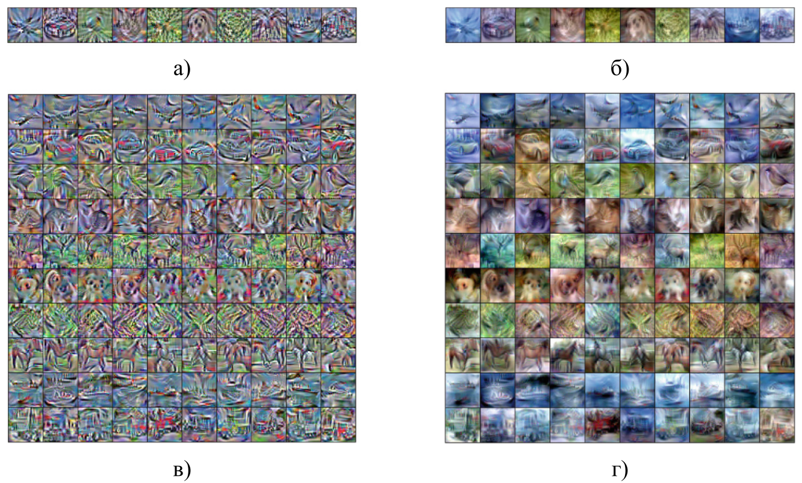]
.center.caption-fig[Приклади синтезованих (ліворуч) та реконструйованих (праворуч) зображень із набору даних CIFAR-10 для різної кількості зображень на клас: 1 (а, б) та 10 (в, г)]

---

class: middle 

.width-100[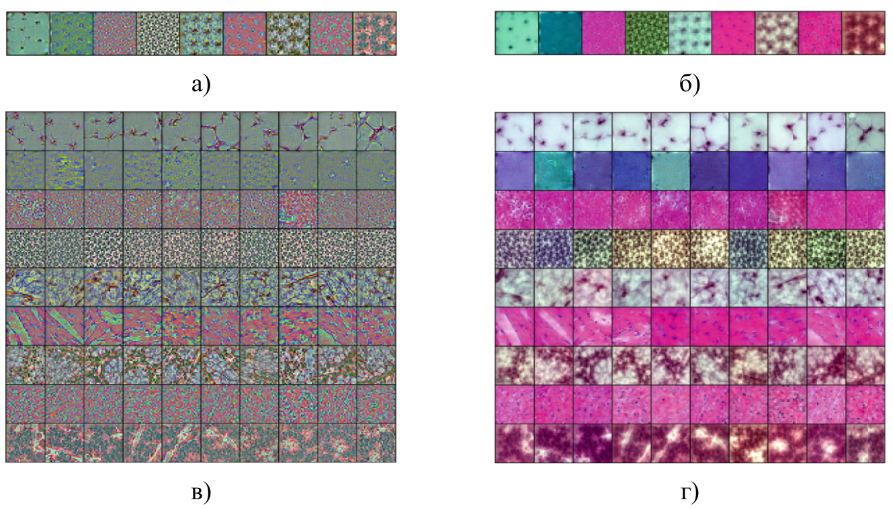]
.center.caption-fig[Приклади синтезованих (ліворуч) та реконструйованих (праворуч) зображень із набору даних PathMNIST для різної кількості
зображень на клас: 1 (а, б) та 10 (в, г)]

---

class: middle 

.width-100[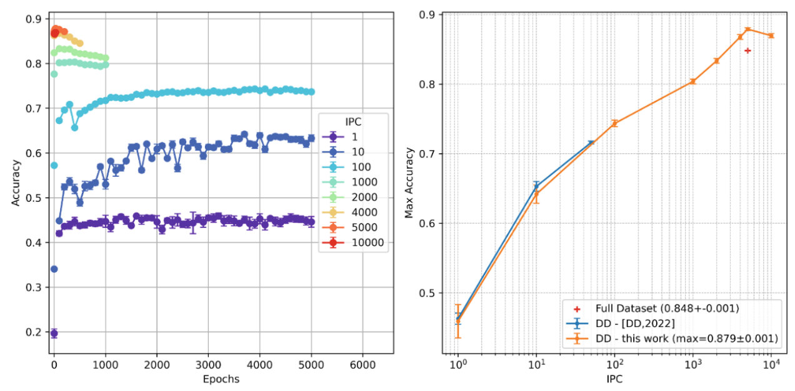]
.center.caption-fig[Вплив на ефективність моделі кількості дистильованих зображень на клас для набору даних CIFAR-10]

---

class: middle 

.width-100[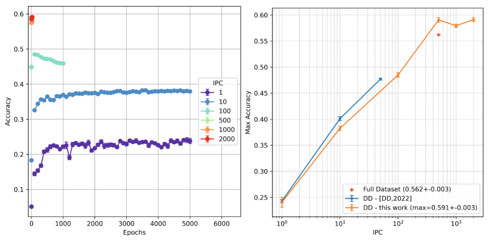]
.center.caption-fig[Вплив на ефективність моделі кількості дистильованих зображень на клас для набору даних CIFAR-100]

---

class: middle
## Порівняння результатів дистиляції датасету

.larger-x[

| Експеримент | CIFAR-10 | CIFAR-100 |
|---|:---:|:---:|
| DD, повний оригінальний набір даних$^1$  | 0.848 ± 0.001 | 0.562 ± 0.003 |
| .bold[Наш метод, дистильований менший набір даних (GDADD)] | <span style="color:#2e7d32; font-weight:bold;">0.879 ± 0.001</span> | <span style="color:#2e7d32; font-weight:bold;">0.591 ± 0.003</span> |
]

 .footnote[$^1$ G. Cazenavette, T. Wang, A. Torralba, A. A. Efros, and J.-Y. Zhu, “Dataset
distillation by matching training trajectories,” in Proceedings of the IEEE/CVF
conference on computer vision and pattern recognition, 2022, pp. 4750–4759.]

---

class: middle 

.width-100[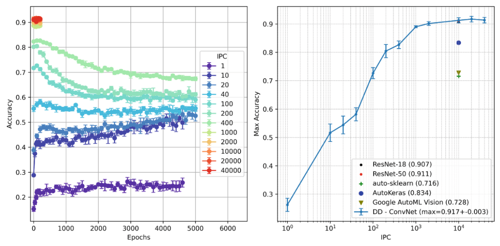]
.center.caption-fig[Вплив на ефективність моделі кількості дистильованих зображень на клас для набору даних PathMNIST]

---

class: middle 

.width-100[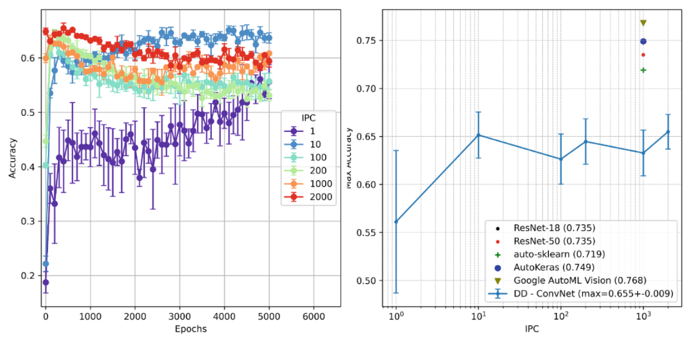]
.center.caption-fig[Вплив на ефективність моделі кількості дистильованих зображень на клас для набору даних DermaMNIST]

---

class: middle 

.width-100[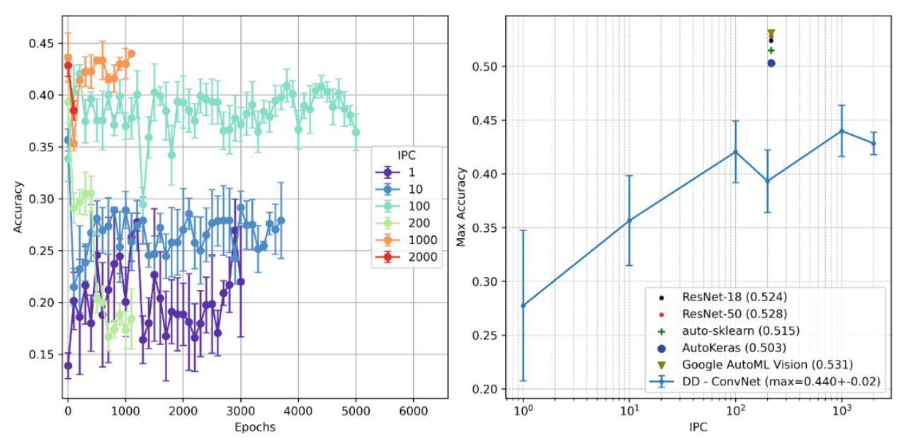]
.center.caption-fig[Вплив на ефективність моделі кількості дистильованих зображень на клас для набору даних RetinaMNIST]

---

class: middle 

.center.caption-fig[Максимальні значення точності на валідаційній вибірці для збалансованого (PathMNIST) та значно незбалансованих
(DermaMNIST, RetinaMNIST) наборів даних]
.width-100[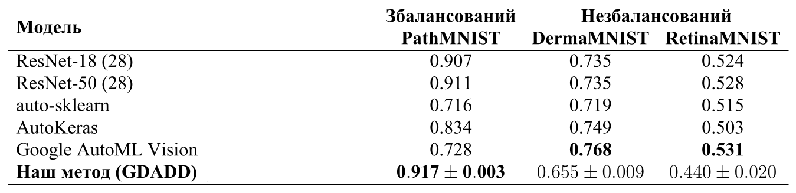]

---

class: middle, center

.width-80[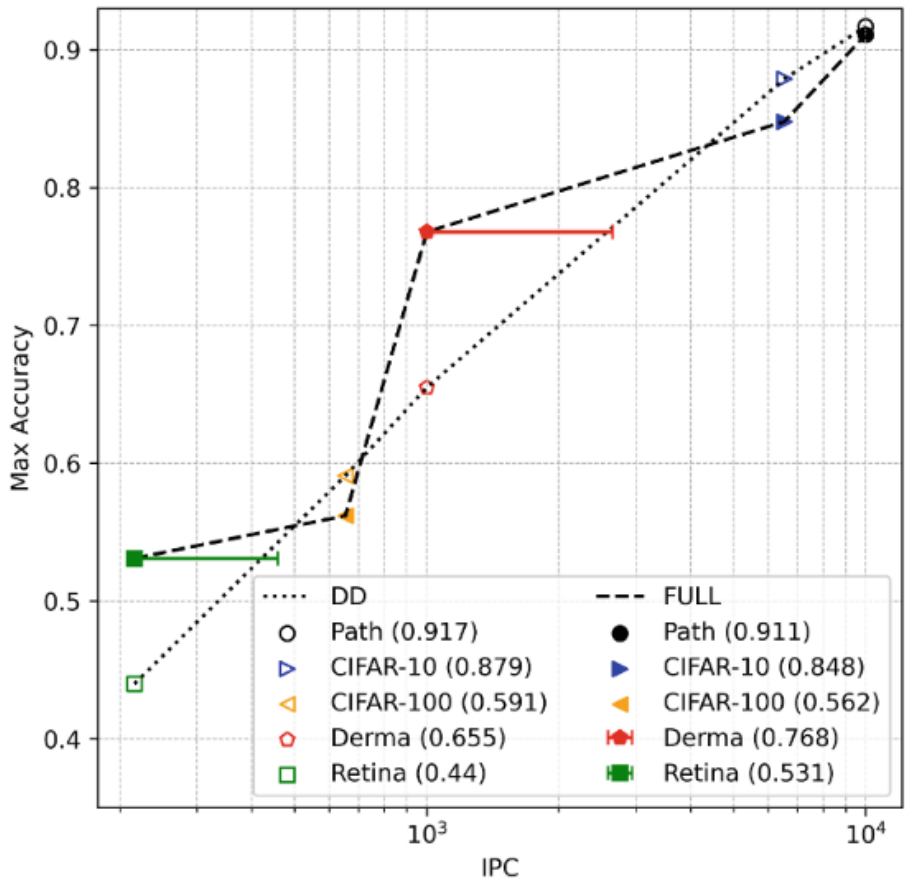]
.center.caption-fig[Порівняння загальної максимальної точності на валідаційній вибірці залежно від значення IPC]

---

class: middle, center

.width-100[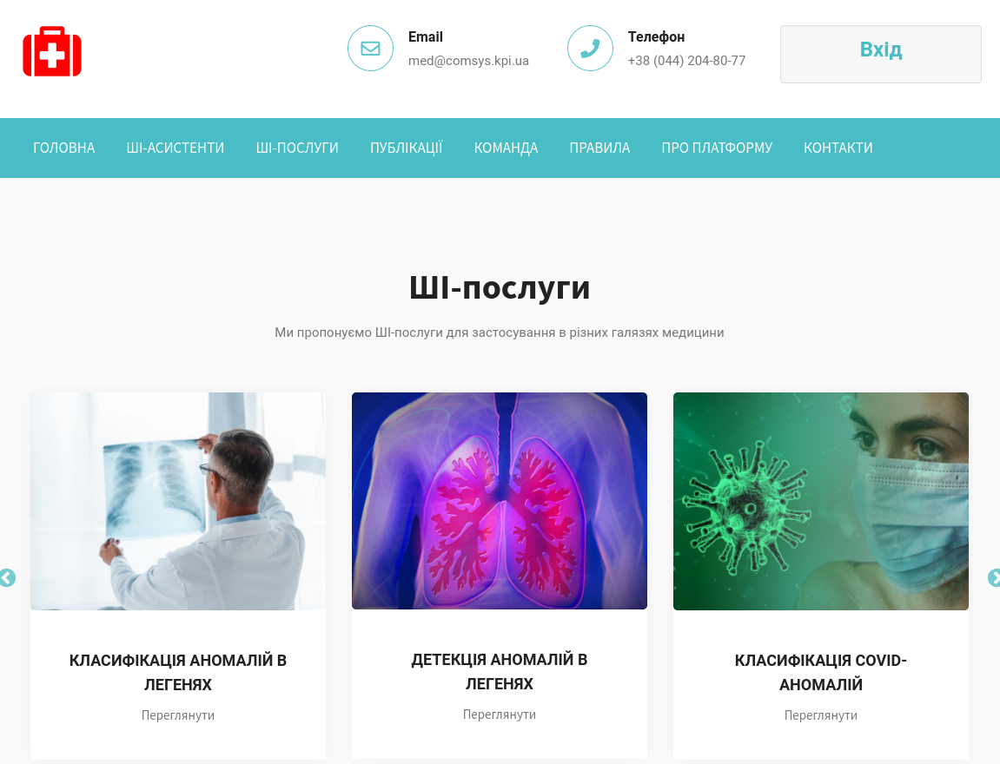]
.center.caption-fig[Інтеграція розроблених методів до складу платформи дистанційного автоматизованого виявлення та діагностики патологій та аномалій у медичних даних]

---

class: middle, 

.width-100[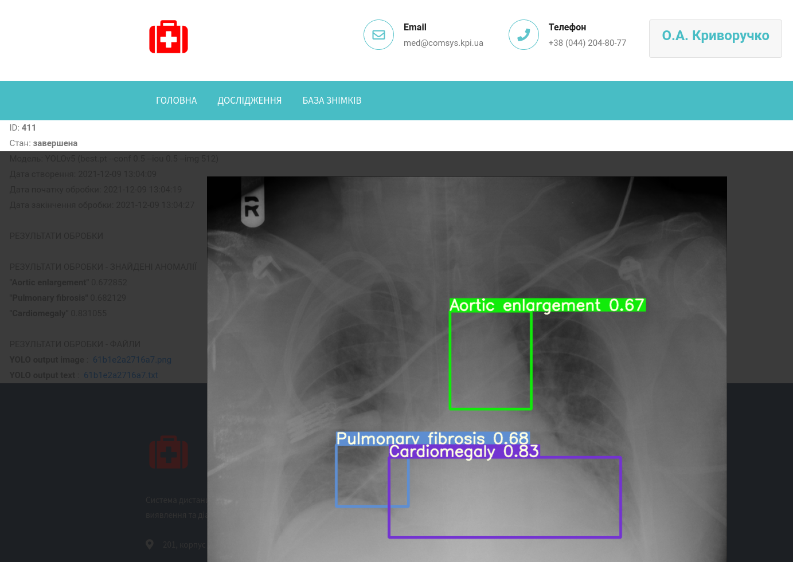]
.center.caption-fig[Приклад результату обробки рентгенограми з локалізацією ймовірних зон аномалій]

.footnote[[med.comsys.kpi.ua](https://med.comsys.kpi.ua)]

---

class: blue-slide, middle, center
count: false

.larger-xx[Висновки]

---

class: black-slide
# Висновки

.smaller-xx[
1. Проведено аналіз сучасних методів машинного та глибинного навчання, які використовуються для задач комп’ютерного зору. Встановлено переваги та недоліки розглянутих підходів, що дозволило сформулювати шляхи для вдосконалення ефективності діагностики легеневих захворювань на основі 2D рентгенограм. Проведений аналіз показав високий потенціал методів глибинного навчання для досягнення точності діагностики на рівні лікарів-експертів, зменшення навантаження на медичний персонал та прискорення обробки великих обсягів медичних даних. Виявлено ключові фактори, що обмежують широке впровадження штучного інтелекту у клінічну практику, зокрема потреба у великих та збалансованих наборах даних, варіативність апаратів і протоколів отримання знімків, а також необхідність забезпечення інтерпретованості результатів для лікарів.

]


???
У дисертаційному дослідженні розв'язане актуальне наукове завдання, яке спрямоване на покращення результатів аналізу медичних даних, зокрема діагностики легеневих захворювань, шляхом створення та оптимізації методів і моделей глибинного машинного навчання для ідентифікації, класифікації та семантичної сегментації об'єктів, зокрема алгоритмів семантичної сегментації анатомічних структур і вилучення тіней кісток з рентгенограм, ансамблевої класифікації у федеративному навчанні, а також методів виключення викидів серед розподілу сегментованих масок та генеративної аугментації даних методом дистиляції набору даних (GDADD). 

У результаті було отримано такі наукові і практичні результати:

---

class: black-slide
count: false

# Висновки
.smaller-xx[

1. .inactive-b[Проведено аналіз сучасних методів машинного та глибинного навчання, які використовуються для задач комп’ютерного зору. Встановлено переваги та недоліки розглянутих підходів, що дозволило сформулювати шляхи для вдосконалення ефективності діагностики легеневих захворювань на основі 2D рентгенограм. Проведений аналіз показав високий потенціал методів глибинного навчання для досягнення точності діагностики на рівні лікарів-експертів, зменшення навантаження на медичний персонал та прискорення обробки великих обсягів медичних даних. Виявлено ключові фактори, що обмежують широке впровадження штучного інтелекту у клінічну практику, зокрема потреба у великих та збалансованих наборах даних, варіативність апаратів і протоколів отримання знімків, а також необхідність забезпечення інтерпретованості результатів для лікарів.]

1. Розроблено технологію попередньої обробки 2D рентгенограм за допомогою сегментації ділянок, які містять цільові об'єкти, з використанням глибоких нейронних мереж типу кодер-декодер, яка на відміну від класифікації на основі всього зображення, дозволяє зосередити подальший аналіз на клінічно значущих ділянках і покращити результати діагностики окремих легеневих захворювань за рахунок зменшення впливу нецільових анатомічних структур на результат класифікації та зменшення розмірності вхідних даних у 3,2 ± 0,7 рази (середня частка площі сегментації -- 0,32 ± 0,06). Експериментально встановлено, що вплив сегментації на результати класифікації є нерівномірним залежно від типу патології та розміру вибірки, при цьому покращення діагностичної точності  спостерігалося лише для окремих класів патологій (Lung Opacity, Consolidation та Pleural Other). Застосування сегментації у поєднанні з аугментацією даних  забезпечило покращення діагностичної точності для 10 із 14 досліджуваних патологій порівняно з моделлю, навченою лише на сегментованих зображеннях (без аугментації). Зменшення кількості нерелевантних ознак завдяки сегментації є особливо корисним для невеликих вибірок, де обмежена кількість прикладів підвищує ризик того, що модель почне враховувати випадкові патерни у фонових областях зображення (поза межами легень) замість клінічно значущих ознак. Для великих вибірок цей ризик зменшується, оскільки достатня кількість прикладів дозволяє моделі самостійно навчитися ігнорувати нерелевантні області зображення без попередньої сегментації.
]

---

class: black-slide
count: false

# Висновки

.smaller-xx[

<ol start="3">
<li> Удосконалено метод глибинного навчання на основі згорткових нейронних мереж за рахунок сегментації анатомічних структур та вилучення з рентгенограм тіней кісток, що дозволяє зменшити перекриття патологічних ознак кістковими структурами, забезпечуючи додаткове зменшення розмірності релевантних ознак на основі сегментованих зображень приблизно у 2 рази (середнє значення частки релевантної площі -- 0,15 ± 0,04), що додатково знижує ризик перенавчання моделі на нерелевантні ознаки за умов обмеженого обсягу навчальної вибірки.</li>

</ol>

]

---

class: black-slide
count: false

# Висновки

.smaller-xx[

<ol start="3">
<li> .inactive-b[Удосконалено метод глибинного навчання на основі згорткових нейронних мереж за рахунок сегментації анатомічних структур та вилучення з рентгенограм тіней кісток, що дозволяє зменшити перекриття патологічних ознак кістковими структурами, забезпечуючи додаткове зменшення розмірності релевантних ознак на основі сегментованих зображень приблизно у 2 рази (середнє значення частки релевантної площі -- 0,15 ± 0,04), що додатково знижує ризик перенавчання моделі на нерелевантні ознаки за умов обмеженого обсягу навчальної вибірки.]</li>

<li> Отримала подальший розвиток техніка зменшення розмірності даних на основі t-SNE з метою виключення викидів серед розподілу сегментованих масок, що дозволило покращити якість вхідних даних для методів глибинного навчання в задачі класифікації патологічних станів легень з 2D рентгенограм.</li>

</ol>

]

---

class: black-slide
count: false

# Висновки

.smaller-xx[

<ol start="3">
<li> .inactive-b[Удосконалено метод глибинного навчання на основі згорткових нейронних мереж за рахунок сегментації анатомічних структур та вилучення з рентгенограм тіней кісток, що дозволяє зменшити перекриття патологічних ознак кістковими структурами, забезпечуючи додаткове зменшення розмірності релевантних ознак на основі сегментованих зображень приблизно у 2 рази (середнє значення частки релевантної площі -- 0,15 ± 0,04), що додатково знижує ризик перенавчання моделі на нерелевантні ознаки за умов обмеженого обсягу навчальної вибірки.]</li>

<li> .inactive-b[Отримала подальший розвиток техніка зменшення розмірності даних на основі t-SNE з метою виключення викидів серед розподілу сегментованих масок, що дозволило покращити якість вхідних даних для методів глибинного навчання в задачі класифікації патологічних станів легень з 2D рентгенограм.]</li>

<li> Розроблено метод класифікації у федеративному навчанні, що ґрунтується на ансамблі опорних моделей у поєднанні з архітектурами низької обчислювальної складності за стратегією «ширина важливіша за глибину», який на відміну від традиційних підходів до збільшення глибини нейронних мереж, дозволяє підвищити узагальнювальну здатність моделі та зменшити ризик перенавчання за рахунок зменшення дисперсії передбачень при агрегуванні частково некорельованих похибок окремих моделей. Експериментально встановлено, що чутливість моделі до кількості локальних епох між раундами усереднення FedAvg зростає зі збільшенням кількості опорних моделей в ансамблі. Найбільшу різницю валідаційної точності між максимальною та мінімальною кількістю локальних епох отримано для моделі з чотирма опорними архітектурами ($N_{MB} = 4$) -- 13,39%. Для моделі з двома опорними архітектурами ($N_{MB} = 2$) ця різниця становила 5%, а для однієї базової моделі ($N_{MB} = 1$) лише 1,89%. Це свідчить про те, що при недостатній кількості локальних епох траєкторії навчання опорних моделей зближуються, що знижує виграш від ансамблювання. </li>

</ol>

]

---

class: black-slide
count: false

# Висновки

.smaller-xx[

<ol start="6">
<li> Проведено експериментальну оцінку ефективності розроблених методів, яка показала, що поєднання сегментації, вилучення тіней кісток, зменшення розмірності даних, аугментації даних та використання ансамблю опорних моделей у рамках федеративного навчання дозволяє покращити узагальнювальну здатність та надійність систем для автоматизованого аналізу візуальних даних, зокрема для комп’ютерної діагностики захворювань з продуктивністю, яка може бути співставною з рівнем лікарів-експертів.</li>

</ol>

]

---

class: black-slide
count: false

# Висновки

.smaller-xx[

<ol start="6">
<li> .inactive-b[Проведено експериментальну оцінку ефективності розроблених методів, яка показала, що поєднання сегментації, вилучення тіней кісток, зменшення розмірності даних, аугментації даних та використання ансамблю опорних моделей у рамках федеративного навчання дозволяє покращити узагальнювальну здатність та надійність систем для автоматизованого аналізу візуальних даних, зокрема для комп’ютерної діагностики захворювань з продуктивністю, яка може бути співставною з рівнем лікарів-експертів.]</li>

<li> Отримала подальший розвиток техніка дистиляції набору даних шляхом узгодження навчальних траєкторій (DDMTT) у формі методу генеративної аугментації даних GDADD, що синтезує компактний набір інформативних синтетичних зображень, на основі яких моделі здатні досягати узагальнювальної здатності, зіставної з моделями, навченими на значно більшому реальному наборі даних. Експериментально підтверджено, що на збалансованому наборі даних PathMNIST валідаційна точність класифікації моделей, навчених на даних, синтезованих методом GDADD (0,917 ± 0,003), є дещо вищою за класичні згорткові архітектури (ResNet-18, ResNet-50) та   перевищує результати методів автоматизованого машинного навчання (auto-sklearn, AutoKeras, Google AutoML Vision) на 9,9-28,1%.</li>

</ol>

]

---

class: black-slide
count: false

# Висновки

.smaller-xx[

<ol start="6">
<li> .inactive-b[Проведено експериментальну оцінку ефективності розроблених методів, яка показала, що поєднання сегментації, вилучення тіней кісток, зменшення розмірності даних, аугментації даних та використання ансамблю опорних моделей у рамках федеративного навчання дозволяє покращити узагальнювальну здатність та надійність систем для автоматизованого аналізу візуальних даних, зокрема для комп’ютерної діагностики захворювань з продуктивністю, яка може бути співставною з рівнем лікарів-експертів.]</li>

<li> .inactive-b[Отримала подальший розвиток техніка дистиляції набору даних шляхом узгодження навчальних траєкторій (DDMTT) у формі методу генеративної аугментації даних GDADD, що синтезує компактний набір інформативних синтетичних зображень, на основі яких моделі здатні досягати узагальнювальної здатності, зіставної з моделями, навченими на значно більшому реальному наборі даних. Експериментально підтверджено, що на збалансованому наборі даних PathMNIST валідаційна точність класифікації моделей, навчених на даних, синтезованих методом GDADD (0,917 ± 0,003), є дещо вищою за класичні згорткові архітектури (ResNet-18, ResNet-50) та   перевищує результати методів автоматизованого машинного навчання (auto-sklearn, AutoKeras, Google AutoML Vision) на 9,9-28,1%.]</li>

</ol>
]

.smaller-x.success[До перспективних напрямів продовження досліджень за тематикою дисертації належить інтеграція мультимодальних медичних даних, зокрема 2D рентгенограм, результатів комп’ютерної томографії та електронних медичних записів, у єдині інтелектуальні діагностичні системи, створення гібридних архітектур глибоких нейронних мереж, що поєднують принципи розширення глибини та ширини обчислювальних структур для підвищення продуктивності та узагальнювальної здатності, а також розробка інтерпретованих моделей штучного інтелекту, результати роботи яких можуть бути інтегровані у клінічні робочі процеси для підтримки прийняття рішень.]

---


exclude: true
class:  middle,

# првл Лол
## KJk dsnkj 
.quote[
Щоразу, коли наукова .bold[стаття представляє певні дані], їх супроводжують межі похибки — скромне, але промовисте нагадування про те, що жодне знання не є повним або досконалим. Це калібрування того, наскільки ми довіряємо тому, що, як нам здається, ми знаємо.
]
.quote-cite[— Карл Саган]

---

class:  middle, center
count: false

.larger-xxx[Дякую за увагу!

⌛] 