class: middle, center,  black-slide

background-image: url(./figures/pic/voice-wave.gif)
background-size: cover

<br>
.larger-x.title[Метод глибинного машинного навчання для ідентифікації, класифікації та семантичної сегментації об’єктів] 

.smaller-x[Результати дисертаційного дослідження на здобуття наукового ступеня]<br>
Доктор фiлософії


<br><br><br><br>
.larger-x[Кочура Юрій Петрович]<br><br>
.left[Науковий керiвник<br>
.bold[Гордієнко Юрій Григорович], д-р. фiз.-мат. наук, проф.]  <br>


 2026

???
Скорочення: https://bati.nubip.edu.ua/index.php/ua/activityfooter/vimogi-do-skorochennya-nazv-naukovikh-stupeniv.html

<!-- .left[Наукові керiвники<br>
.bold[Гордієнко Юрій Григорович], д-р. фiз.-мат. наук, проф. <br>
.bold[Стiренко Сергiй Григорович], д-р. тех. наук, проф.] --> 

---

exclude: true
class:  black-slide, middle

.grid[
.kol-1-2[ 
.circle.center.width-80[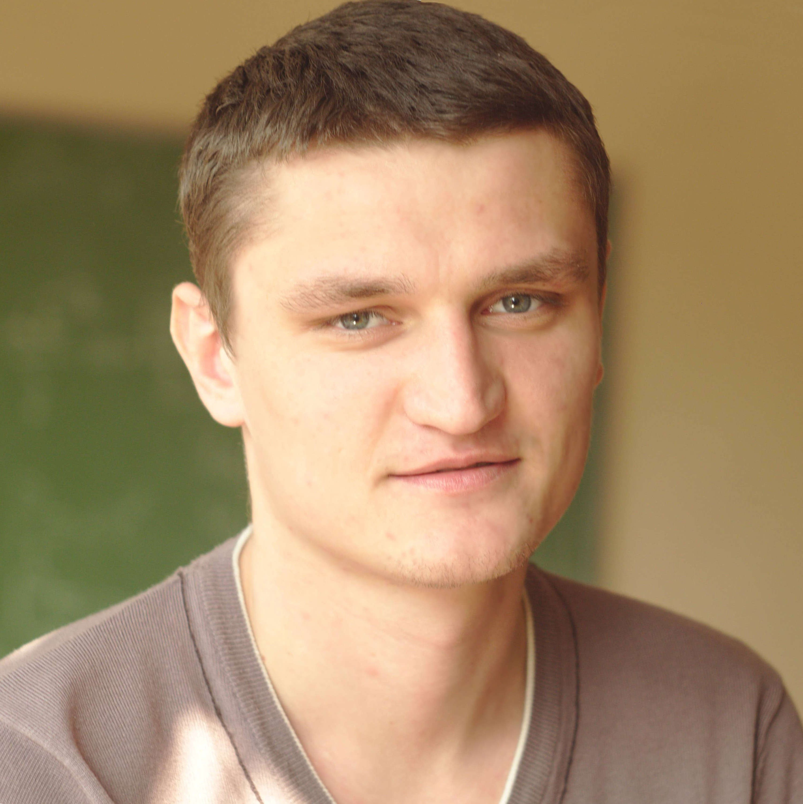]
.bold.center[👤 Кочура Юрій Петрович ] 
<span style="display:block; margin:10px 0;"></span>
.bold.center[🏢 Кафедра ОТ, ФІОТ]]
.kol-1-2[ 
.circle.center.width-75[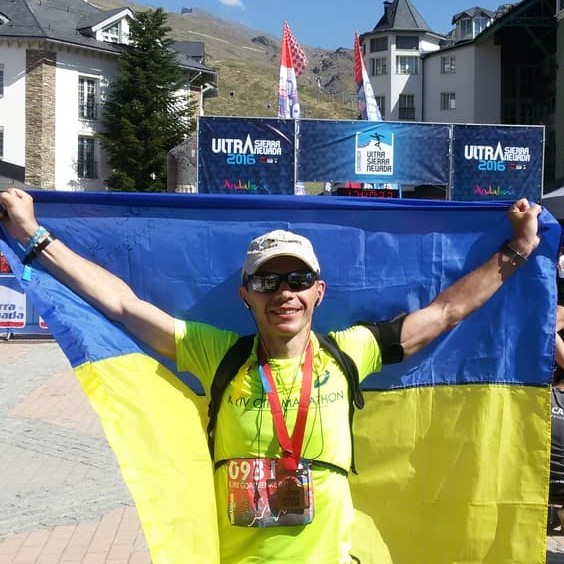]
.bold.center[👤 Гордієнко Юрій Григорович] 
<span style="display:block; margin:10px 0;"></span>
.bold.center[🎓 Доктор фіз.-мат. наук, професор]
<span style="display:block; margin:10px 0;"></span>
.bold.center[🏢 Кафедра ОТ, ФІОТ]
]]

---

class:  black-slide,
background-image: url("https://www.dropbox.com/scl/fi/ples3jkjtxpmh7j9l81w9/vecteezy-2.gif?rlkey=bfzhdgfcegdavmgl5dnnfdgof&st=1n6pcl3y&dl=1")
background-size: cover

# Зміст

.larger-x[ <p class="shadow" style="line-height: 200%;"> 

  1. Публікації за темою дисертації<br>
  2. Актуальність теми <br>
  3. Мета і задачі дослідження <br>
  4. Об’єкт і предмет дослідження <br>
  5. Зв'язок з науковими програмами <br>
  6. Переваги та недолiки iснуючих методiв <br>
  7. Наукова новизна результатiв <br>
  8. Аналіз і обговорення отриманих результатів <br>
  9. Висновки <br>    
</p>]

---

class: blue-slide, middle, center
count: false

.larger-xx[Публікації за темою дисертації]

---

class: black-slide, middle

.larger-xm.success[Основні результати за темою дисертації були висвітлені в .bold[22] наукових працях, які розкривають основний зміст дисертації, зокрема у 16 наукових статтях, з яких:
- 1 стаття у закордонному фаховому виданні першого квартиля (Q1), 
- 8 статей у закордонних фахових виданнях третього квартиля (Q3), 
- 6 статей у закордонних фахових виданнях четвертого квартиля (Q4)
-  1 стаття у фаховому виданні України категорії Б, 

а також у 6 матеріалах науково-технічних конференцій. Із 22 наукових праць 21 опубліковано у закордонних виданнях, які проіндексовані у базі даних Scopus.]

---

class: black-slide, middle, 

# Публікації

.smaller-x[
.pub-list[
.pub-item[
.pub-year[1.]
.pub-content[
.pub-title[Generative Data Augmentation by Dataset Distillation.]
.pub-authors[Gordienko, Y., Nowakowski, G., Kochura, Y., Taran, V., & Stirenko, S.]
.pub-venue[Communications in Computer and Information Science, 2026, vol. 2696, pp. 105–118.]
.pub-meta[.pub-scopus[Scopus] .pub-q4[Q4]]
]
]

.pub-item[
.pub-year[2.]
.pub-content[
.pub-title[Multi-Backbone Ensembling for Performance Improvement in Federated Learning Setup.]
.pub-authors[Gordienko, Y., Gordienko, N., El Mhamdi, E. M., Kochura, Y., & Stirenko, S.]
.pub-venue[Lecture Notes in Networks and Systems, 2026, vol. 1598, pp. 129–138.]
.pub-meta[.pub-scopus[Scopus] .pub-q4[Q4]]
]
]

.pub-item[
.pub-year[3.]
.pub-content[
.pub-title[UAeroNet: Domain-Specific Dataset for Automation of Unmanned Aerial Vehicles.]
.pub-authors[Kochura, Y., Trochun, Y., Taran, V., Gordienko, Y., Rokovyi, O., & Stirenko, S.]
.pub-venue[Information, Computing and Intelligent Systems, no. 7, pp. 83–95, 2025.]
.pub-meta[.pub-scopus[Фахове видання України категорії Б]]
]
]

.pub-item[
.pub-year[4.]
.pub-content[
.pub-title[Multimodal Metadata Augmentation for Federated Learning in Medical Applications.]
.pub-authors[Gordienko, Y., Shulha, M., Kochura, Y., Rokovyi, O., Taran, V., Alienin, O., & Stirenko, S.]
.pub-venue[Lecture Notes in Networks and Systems, 2024, vol. 1002, pp. 537–547.]
.pub-meta[.pub-scopus[Scopus] .pub-q4[Q4]]
]
]

]
]

---

class: black-slide, middle,

# Публікації

.smaller-x[
.pub-list[
.pub-item[
.pub-year[5.]
.pub-content[
.pub-title[Ensemble Knowledge Distillation for Edge Intelligence in Medical Applications.]
.pub-authors[Gordienko, Y., Shulha, M., Kochura, Y., Rokovyi, O., Alienin, O., Taran, V., & Stirenko, S.]
.pub-venue[Studies in Computational Intelligence, 2023, vol. 1100, pp. 135–168.]
.pub-meta[.pub-scopus[Scopus] .pub-q4[Q4]]
]
]

.pub-item[
.pub-year[6.]
.pub-content[
.pub-title[Fuzzy Metadata Augmentation for Multimodal Data Classification.]
.pub-authors[Gordienko, Y., Shulha, M., Kochura, Y., Rokovyi, O., Alienin, O., & Stirenko, S.]
.pub-venue[Lecture Notes on Data Engineering and Communications Technologies, 2023, vol. 166, pp. 157–172.]
.pub-meta[.pub-scopus[Scopus] .pub-q3[Q3]]
]
]

.pub-item[
.pub-year[7.]
.pub-content[
.pub-title[Edge Intelligence for Medical Applications Under Field Conditions.]
.pub-authors[Taran, V., Gordienko, Y., Rokovyi, O., Alienin, O., Kochura, Y., & Stirenko, S.]
.pub-venue[Lecture Notes on Data Engineering and Communications Technologies, 2022, vol. 135, pp. 71–80.]
.pub-meta[.pub-scopus[Scopus] .pub-q3[Q3]]
]
]

.pub-item[
.pub-year[8.]
.pub-content[
.pub-title[Artificial Intelligence Platform for Distant Computer-Aided Detection (CADe) and Computer-Aided Diagnosis (CADx) of Human Diseases.]
.pub-authors[Alienin, O., Rokovyi, O., Gordienko, Y., Kochura, Y., Taran, V., & Stirenko, S.]
.pub-venue[Lecture Notes on Data Engineering and Communications Technologies, 2022, vol. 135, pp. 91–100.]
.pub-meta[.pub-scopus[Scopus] .pub-q3[Q3]]
]
]
]
]

---

class: black-slide, middle,

# Публікації

.smaller-xm[
.pub-list[
.pub-item[
.pub-year[9.]
.pub-content[
.pub-title[Deep Learning for Melanoma Detection with Testing Time Data Augmentation.]
.pub-authors[Doms, V., Gordienko, Y., Kochura, Y., Rokovyi, O., Alienin, O., & Stirenko, S.]
.pub-venue[Lecture Notes on Data Engineering and Communications Technologies, 2021, vol. 82, pp. 131–140.]
.pub-meta[.pub-scopus[Scopus] .pub-q3[Q3]]
]
]

.pub-item[
.pub-year[10.]
.pub-content[
.pub-title["Last Mile" Optimization of Edge Computing Ecosystem with Deep Learning Models and Specialized Tensor Processing Architectures.]
.pub-authors[Gordienko, Y., Kochura, Y., Taran, V., Gordienko, N., Rokovyi, O., Alienin, O., & Stirenko, S.]
.pub-venue[Advances in Computers, 2021, vol. 122, pp. 303–341.]
.pub-meta[.pub-scopus[Scopus] .pub-q1[Q1]]
]
]

.pub-item[
.pub-year[11.]
.pub-content[
.pub-title[Scaling Analysis of Specialized Tensor Processing Architectures for Deep Learning Models.]
.pub-authors[Gordienko, Y., Kochura, Y., Taran, V., Gordienko, N., Rokovyi, A., Alienin, O., & Stirenko, S.]
.pub-venue[Studies in Computational Intelligence, 2020, vol. 866, pp. 65–99.]
.pub-meta[.pub-scopus[Scopus] .pub-q4[Q4]]
]
]

.pub-item[
.pub-year[12.]
.pub-content[
.pub-title[Effect of Data Augmentation and Lung Mask Segmentation for Automated Chest Radiograph Interpretation of Some Lung Diseases.]
.pub-authors[Gang, P., Zeng, W., Gordienko, Y., Kochura, Y., Alienin, O., Rokovyi, O., & Stirenko, S.]
.pub-venue[Communications in Computer and Information Science, 2019, vol. 1142, pp. 333–340.]
.pub-meta[.pub-scopus[Scopus] .pub-q4[Q4]]
]
]
]
]

---

class: black-slide, middle,

# Публікації

.smaller-xm[
.pub-list[
.pub-item[
.pub-year[13.]
.pub-content[
.pub-title[Adaptive Iterative Pruning for Accelerating Deep Neural Networks.]
.pub-authors[Gordienko, Y., Kochura, Y., Taran, V., Gordienko, N., Bugaiov, A., & Stirenko, S.]
.pub-venue[11th International Scientific and Practical Conference on Electronics and Information Technologies (ELIT 2019), 2019, pp. 173–178.]
.pub-meta[.pub-scopus[Scopus]]
]
]

.pub-item[
.pub-year[14.]
.pub-content[
.pub-title[Batch Size Influence on Performance of Graphic and Tensor Processing Units During Training and Inference Phases.]
.pub-authors[Kochura, Y., Gordienko, Y., Taran, V., Gordienko, N., Rokovyi, A., Alienin, O., & Stirenko, S.]
.pub-venue[Advances in Intelligent Systems and Computing, 2019, vol. 938, pp. 658–668.]
.pub-meta[.pub-scopus[Scopus] .pub-q3[Q3]]
]
]

.pub-item[
.pub-year[15.]
.pub-content[
.pub-title[Performance Evaluation of Deep Learning Networks for Semantic Segmentation of Traffic Stereo-Pair Images.]
.pub-authors[Taran, V., Gordienko, Y., Gordienko, N., Rokovyi, A., Kochura, Y., Alienin, O., & Stirenko, S.]
.pub-venue[ACM International Conference Proceeding Series, 2018, pp. 73–80.]
.pub-meta[.pub-scopus[Scopus]]
]
]

.pub-item[
.pub-year[16.]
.pub-content[
.pub-title[Chest X-Ray Analysis of Tuberculosis by Deep Learning with Segmentation and Augmentation.]
.pub-authors[Stirenko, S., Kochura, Y., Alienin, O., Rokovyi, O., Gordienko, Y., Gang, P., & Zeng, W.]
.pub-venue[38th International Conference on Electronics and Nanotechnology (ELNANO 2018), 2018, pp. 422–428.]
.pub-meta[.pub-scopus[Scopus]]
]
]
]
]

---

class: black-slide, middle,

# Публікації

.smaller-x[
.pub-list[
.pub-item[
.pub-year[17.]
.pub-content[
.pub-title[Dimensionality Reduction in Deep Learning for Chest X-Ray Analysis of Lung Cancer.]
.pub-authors[Gang, P., Zhen, W., Zeng, W., Gordienko, Y., Kochura, Y., Alienin, O., Rokovyi, O., & Stirenko, S.]
.pub-venue[10th International Conference on Advanced Computational Intelligence (ICACI 2018), 2018, pp. 878–883.]
.pub-meta[.pub-scopus[Scopus]]
]
]

.pub-item[
.pub-year[18.]
.pub-content[
.pub-title[Deep Learning with Lung Segmentation and Bone Shadow Exclusion Techniques for Chest X-Ray Analysis of Lung Cancer.]
.pub-authors[Gordienko, Y., Gang, P., Hui, J., Zeng, W., Kochura, Y., Alienin, O., Rokovyi, O., & Stirenko, S.]
.pub-venue[Advances in Intelligent Systems and Computing, 2018, vol. 754, pp. 638–647.]
.pub-meta[.pub-scopus[Scopus] .pub-q3[Q3]]
]
]

.pub-item[
.pub-year[19.]
.pub-content[
.pub-title[Performance Analysis of Open Source Machine Learning Frameworks for Various Parameters in Single-Threaded and Multi-Threaded Modes.]
.pub-authors[Kochura, Y., Stirenko, S., Alienin, O., Novotarskiy, M., & Gordienko, Y.]
.pub-venue[Advances in Intelligent Systems and Computing, 2018, vol. 689, pp. 243–256.]
.pub-meta[.pub-scopus[Scopus] .pub-q3[Q3]]
]
]
]
]

---

class: black-slide, middle,

# Публікації

.smaller-x[
.pub-list[
.pub-item[
.pub-year[20.]
.pub-content[
.pub-title[User-Driven Intelligent Interface on the Basis of Multimodal Augmented Reality and Brain-Computer Interaction for People with Functional Disabilities.]
.pub-authors[Gang, P., Hui, J., Stirenko, S., Gordienko, Y., Shemsedinov, T., Alienin, O., Kochura, Y., Gordienko, N., Rojbi, A., Lopez Benito, J., & Artetxe Gonzalez, E.]
.pub-venue[Advances in Intelligent Systems and Computing, 2018, vol. 886, pp. 612–631.]
.pub-meta[.pub-scopus[Scopus] .pub-q3[Q3]]
]
]


.pub-item[
.pub-year[21.]
.pub-content[
.pub-title[Comparative Performance Analysis of Neural Networks Architectures on H2O Platform for Various Activation Functions.]
.pub-authors[Kochura, Y., Stirenko, S., & Gordienko, Y.]
.pub-venue[International Young Scientists Forum on Applied Physics and Engineering (YSF 2017), 2017, pp. 70–73.]
.pub-meta[.pub-scopus[Scopus]]
]
]

.pub-item[
.pub-year[22.]
.pub-content[
.pub-title[Comparative Analysis of Open Source Frameworks for Machine Learning with Use Case in Single-Threaded and Multi-Threaded Modes.]
.pub-authors[Kochura, Y., Stirenko, S., Alienin, O., Novotarskiy, M., & Gordienko, Y.]
.pub-venue[12th International Scientific and Technical Conference on Computer Sciences and Information Technologies (CSIT 2017), 2017, vol. 1, pp. 373–376.]
.pub-meta[.pub-scopus[Scopus]]
]
]
]
]

---


exclude: true
class: black-slide, middle

.qr-layout[
.qr-text[

# Повний перелік

Відскануйте QR-код або перейдіть за посиланням, щоб переглянути повний перелік наукових праць.

.qr-url[🔗 https://docs.google.com/spreadsheets/d/1klLBoxAHcaCt_xi6hSAnBVTWXZqS9-j743C29vdzrUs/edit?usp=sharing]
]

.qr-box[
<div id="qr-render"></div>
.qr-caption[Сканувати камерою]
]
]

---

class: blue-slide, middle, center
count: false

.larger-xx[Актуальність теми]

---

class:  black-slide, 


- У галузi охорони здоров’я спостерiгається стрiмке зростання застосування методiв штучного iнтелекту та збiльшення числа лiкарiв, якi використовують iнтелектуальнi методи обробки даних для прийняття клiнiчних рiшень.

.footnote[Джерело: [American Medical Association Augmented Intelligence Research: Physician sentiments around the use of AI in heath care:
motivations, opportunities, risks, and use cases, 2025.](https://www.optomed.com/us/wp-content/uploads/sites/2/2025/06/physician-ai-sentiment-report-2025.pdf)]

---

class:  black-slide, 
count:false

- .inactive-b[У галузi охорони здоров’я спостерiгається стрiмке зростання застосування методiв штучного iнтелекту та збiльшення числа лiкарiв, якi використовують iнтелектуальнi методи обробки даних для прийняття клiнiчних рiшень.] 
- Особливе значення має застосування методiв комп’ютерного зору для аналiзу .bold[рентгенограм грудної клiтки] &mdash; найпоширенiшого радiологiчного дослiдження, яке виконує ключову роль для скринiнгу, дiагностики та лiкування захворювань органiв грудної порожнини, багато з яких є лiдируючими причинами смертностi у всьому свiтi.

.footnote[Джерело: [Guo, L., Zhou, C., Xu, J., Huang, C., Yu, Y., & Lu, G. (2024). Deep learning for chest X-ray diagnosis: competition between radiologists with or without artificial intelligence assistance. Journal of Imaging Informatics in Medicine, 37(3), 922-934. DOI: 10.1007/s10278-024-00990-6.](https://pmc.ncbi.nlm.nih.gov/articles/PMC11169143/)]

---

class:  black-slide,
count:false

- .inactive-b[У галузi охорони здоров’я спостерiгається стрiмке зростання застосування методiв штучного iнтелекту та збiльшення числа лiкарiв, якi використовують iнтелектуальнi методи обробки даних для прийняття клiнiчних рiшень.] 
- .inactive-b[Особливе значення має застосування методiв комп’ютерного зору для аналiзу рентгенограм грудної клiтки &mdash; найпоширенiшого радiологiчного дослiдження, яке виконує ключову роль для скринiнгу, дiагностики та лiкування захворювань органiв грудної порожнини, багато з яких є лiдируючими причинами смертностi у всьому свiтi.]
- Сучаснi системи комп’ютерного зору продемонстрували високу ефективнiсть у задачах класифiкацiї та сегментацiї медичних зображень, проте iснує потреба в їх оптимiзацiї для досягнення точностi, швидкодiї та надiйностi, спiвставних або вищих за результати експертiв-радiологiв. 

---

class:  black-slide,
count:false

- .inactive-b[У галузi охорони здоров’я спостерiгається стрiмке зростання застосування методiв штучного iнтелекту та збiльшення числа лiкарiв, якi використовують iнтелектуальнi методи обробки даних для прийняття клiнiчних рiшень.] 
- .inactive-b[Особливе значення має застосування методiв комп’ютерного зору для аналiзу рентгенограм грудної клiтки &mdash; найпоширенiшого радiологiчного дослiдження, яке виконує ключову роль для скринiнгу, дiагностики та лiкування захворювань органiв грудної порожнини, багато з яких є лiдируючими причинами смертностi у всьому свiтi.]
- .inactive-b[Сучаснi системи комп’ютерного зору продемонстрували високу ефективнiсть у задачах класифiкацiї та сегментацiї медичних зображень, проте iснує потреба в їх оптимiзацiї для досягнення точностi, швидкодiї та надiйностi, спiвставних або вищих за результати експертiв-радiологiв.]
-  Раннє виявлення легеневих патологій відкриває можливість пацієнтам отримувати ефективне лікування на початкових етапах, що може суттєво підвищити шанси на одужання та зменшити ризик ускладнень. Це обумовлює актуальнiсть розробки нових комплексних методiв глибинного машинного навчання для аналізу медичних даних.

---
class:  black-slide, middle

.qr-text[
## Проблематика
]

.larger-x.alert[У медичній практиці помилки поділяються на дві основні категорії: .bold[помилки сприйняття та когнітивні помилки], які призводять до невиявлення або неправильної інтерпретації патологій. Помилки сприйняття становлять .bold[60–80%] усіх радіологічних помилок [[1](https://www.ajronline.org/doi/10.2214/AJR.16.16963)] і є головною причиною високої частоти невиявлених аномалій. Крім того, деякі патології можуть залишатися непоміченими через технічні або фізичні обмеження методів візуалізації, такі як низька роздільна здатність медичних знімків або обмежена контрастність тканин.]

.footnote[Джерело: [S. Waite, J. Scott, B. Gale, T. Fuchs, S. Kolla, and D. Reede, “Interpretive error in radiology”, American Journal of Roentgenology, vol. 208, no. 4, pp. 739–749, 2017.](https://www.ajronline.org/doi/10.2214/AJR.16.16963)]

---

class:  black-slide, middle

.qr-text[
## Проблематика
]

.larger-x.alert[Процес інтерпретації зображень залежить від візуального сприйняття, розпізнавання образів, пам’яті та аналітичного мислення лікаря. Часто робота лікарів виконується в умовах численних відволікаючих факторів, що підвищують навантаження та викликають втому. Через людський фактор певний рівень помилок у діагностиці є неминучим навіть у досвідчених спеціалістів.]

.footnote[Джерело: [S. Waite, J. Scott, B. Gale, T. Fuchs, S. Kolla, and D. Reede, “Interpretive error in radiology”, American Journal of Roentgenology, vol. 208, no. 4, pp. 739–749, 2017.](https://www.ajronline.org/doi/10.2214/AJR.16.16963)]

---

class:  black-slide, middle

.larger-x[Розробка та впровадження інтелектуальних методів обробки даних у медичну практику може допомогти знизити ризик медичних помилок та підвищити ефективність медичних закладів шляхом надання лікарю релевантних діагностичних підказок та швидкого аналізу великих обсягів медичних даних.]

---

class: blue-slide, middle, center
count: false

.larger-xx[Мета і задачі дослідження]

---

class: black-slide

# Мета і задачі дослідження

.success[Метою даної дисертацiйної роботи є розробка методу глибинного навчання для iдентифiкацiї, класифiкацiї та семантичної сегментацiї об’єктiв з рiвнем продуктивностi (влучнiсть, чутливість, швидкiсть передбачення), що є вищим або спiвставним iз продуктивнiстю фахiвцiв-експертiв у галузi дiагностики легеневих захворювань.]

---

class: black-slide

# Мета і задачі дослідження

.success[Метою даної дисертацiйної роботи є розробка методу глибинного навчання для iдентифiкацiї, класифiкацiї та семантичної сегментацiї об’єктiв з рiвнем продуктивностi (влучнiсть, чутливість, швидкiсть передбачення), що є вищим або спiвставним iз продуктивнiстю фахiвцiв-експертiв у галузi дiагностики легеневих захворювань.]

.qr-text[
## Основні завдання:
]

1. Проаналiзувати переваги та недолiки iснуючих методiв машинного навчання, якi застосовуються до задач комп’ютерного зору, запропонувати шляхи вдосконалення;

---

class: black-slide
count: false

# Мета і задачі дослідження

.success[Метою даної дисертацiйної роботи є розробка методу глибинного навчання для iдентифiкацiї, класифiкацiї та семантичної сегментацiї об’єктiв з рiвнем продуктивностi (влучнiсть, чутливість, швидкiсть передбачення), що є вищим або спiвставним iз продуктивнiстю фахiвцiв-експертiв у галузi дiагностики легеневих захворювань.]

.qr-text[
## Основні завдання:
]

1. .inactive-b[Проаналiзувати переваги та недолiки iснуючих методiв машинного навчання, якi застосовуються до задач комп’ютерного зору, запропонувати шляхи вдосконалення;]
2. Адаптувати та вдосконалити методи глибинного навчання для ефективної дiагностики легеневих захворювань з 2D рентгенограм;


---

class: black-slide
count: false

# Мета і задачі дослідження

.success[Метою даної дисертацiйної роботи є розробка методу глибинного навчання для iдентифiкацiї, класифiкацiї та семантичної сегментацiї об’єктiв з рiвнем продуктивностi (влучнiсть, чутливість, швидкiсть передбачення), що є вищим або спiвставним iз продуктивнiстю фахiвцiв-експертiв у галузi дiагностики легеневих захворювань.]

.qr-text[
## Основні завдання:
]

1. .inactive-b[Проаналiзувати переваги та недолiки iснуючих методiв машинного навчання, якi застосовуються до задач комп’ютерного зору, запропонувати шляхи вдосконалення;]
2. .inactive-b[Адаптувати та вдосконалити методи глибинного навчання для ефективної дiагностики легеневих захворювань з 2D рентгенограм;]
3. Розробити технологiю попередньої обробки графiчних даних за допомогою сегментацiї дiлянок, якi мiстять цiльовi об’єкти, на основi глибинних нейронних мереж типу кодер-декодер.

---

class: blue-slide, middle, center
count: false

.larger-xx[Об’єкт і предмет дослідження]

---

class: black-slide, middle


## Об’єкт дослiдження

.title.larger-x[Математичнi методи глибинного навчання для дiагностики легеневих захворювань з 2D рентгенограм.]


---

class: black-slide, middle

## Предмет дослiдження

.title.larger-x[Методи пiдвищення ефективностi нейронних мереж, що базуються на пiдходах орiєнтованих на данi: вилучення тiней кiсток, маски сегментацiї та зменшення розмiрностi даних.]


???
Пiдхiд, який орiєнтований на данi, стосується отримання правильного типу та систематичної змiни даних з метою вдосконалення якостi та продуктивностi моделей машинного навчання.

---

class: blue-slide, middle, center
count: false

.larger-xx[Зв'язок з науковими програмами]

---

class: black-slide, middle,

.larger-x.title[Робота виконана в рамках науково-дослiдного проєкту .bold[«Платформа штучного iнтелекту для дистанцiйного автоматизованого виявлення та дiагностики захворювань людини»] (реєстрацiйний номер 2020.01/0490), який реалiзовувався за рахунок грантової пiдтримки .bold[Нацiонального фонду дослiджень України] (протокол №21 вiд 16-17 вересня 2020 року) на 2020-2021 роки в рамках конкурсу «Наука для безпеки людини та суспiльства».]

???
Тема дисертацiйної роботи входить до затвердженого плану наукової роботи кафедри ОТ, що враховує розпорядження Кабiнету Мiнiстрiв України вiд 2 грудня 2020 р. № 1556-р про схвалення Концепцiї розвитку штучного iнтелекту в Українi.

---


class: blue-slide, middle, center
count: false

.larger-xx[Переваги та недолiки iснуючих методiв]

Методи аналізу  візуальних даних та шляхи вдосконалення

---


class:  middle

.width-100[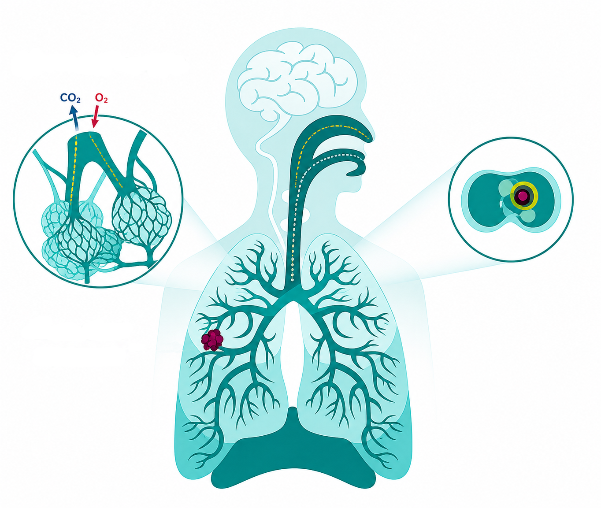]

.footnote[[Kaggle Data Science Bowl 2017](https://www.kaggle.com/c/data-science-bowl-2017)]

???
Легені живлять нас киснем, необхідним для транспортування кров'ю до клітин і вироблення енергії, водночас видаляючи з організму вуглекислий газ (CO₂) — продукт клітинного метаболізму.

---


class: black-slide, middle, 

.center[<iframe src="datasets_slide.html" width="600" height="600" style="border:none;"></iframe>]

.footnote[[Two public chest X-ray datasets for computer-aided screening of pulmonary diseases](https://pmc.ncbi.nlm.nih.gov/articles/PMC4256233/), [JSRT Database](http://db.jsrt.or.jp/eng.php), [Development of a Digital Image Database for Chest Radiographs ...](https://www.ajronline.org/doi/pdf/10.2214/ajr.174.1.1740071)]

---

class: black-slide, middle, 

# JSRT vs BSE-JSRT

.center[<iframe src="before-after.html" width="600" height="600" style="border:none;"></iframe>]

---


class: black-slide, middle
.center[<iframe src="cancer_stats_slide.html" width="600" height="600" style="border:none;"></iframe>]

---

class: black-slide, middle
.center[<iframe src="cnn_architectures_table.html" width="770" height="450" style="border:none;"></iframe>]

---

class: black-slide, middle, 

## Вiзуальне сприйняття інформації 

.center[<iframe src="human-machine.html" width="600" height="600" style="border:none;"></iframe>]

людиною vs комп’ютером

---


background-image: url("./figures/pic/convout4.png")
background-size: contain
## Обчислення карти ознак у згортковому шарі
---

background-image: url("./figures/pic/filters.png")
background-size: contain
## Згортка рентгенограми за допомогою різних фiльтрiв
---


background-image: url("./figures/pic/DepthwiseSeparable.png")
background-size: contain
# Роздiльна згортка по глибинi
---

background-image: url("./figures/pic/Batch-Size.png")
background-size: contain
# Вплив розміру пакета даних

<br><br><br><br><br><br><br><br>
<br><br><br><br><br><br>
.smaller-xx[Досліджено систематичний вплив розмiру пакета даних (batch size) на продуктивнiсть GPU (NVIDIA
Tesla K80) та TPU (Google Cloud TPUv2) пiд час етапiв навчання та передбачення нейронної мережi, яка складалась з трьох згорткових та двох повнозв’язних шарiв.]

---

class:  middle
# Прискорення обчислень на GPU K80 vs TPUv2

.width-90[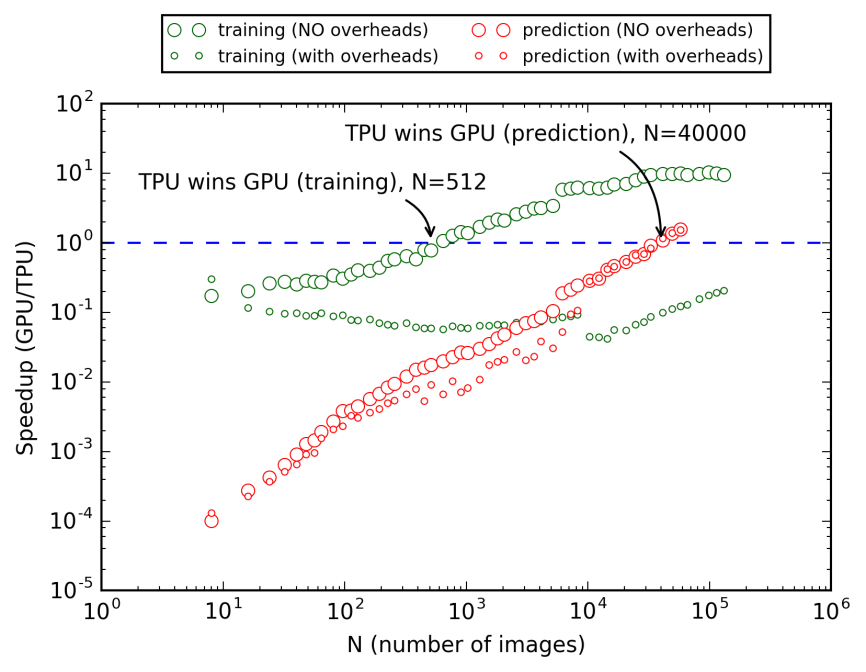]

---

class: blue-slide, middle, center
count: false

.larger-xx[Наукова новизна результатiв]

---

background-image: url("./figures/pic/pipline.png")
background-size: contain

<div style="position: absolute; right: 2em; top: 20%; transform: translateY(-50%); width: 27%; background: rgba(255,255,255,0.9); border: 1px solid #b0bec5; border-radius: 6px; padding: 0.8em; font-size: 0.7em; color: #555;  line-height: 1.5;">
  Метод попередньої обробки графiчних даних iз використанням сегментацiї дiлянок, якi мiстять цiльовi об’єкти
</div>

---

exclude: true
class: middle, 

.center.width-40[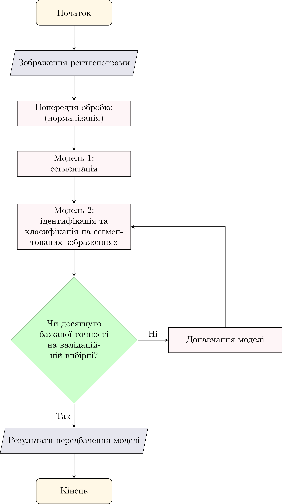]

.caption-fig[Метод попередньої обробки графiчних даних iз використанням сегментацiї дiлянок, якi мiстять цiльовi об’єкти]

---

background-image: url("./figures/pic/pipline_without_bone_shadows.png")
background-size: contain

<div style="position: absolute; right: 2em; top: 20%; transform: translateY(-50%); width: 27%; background: rgba(255,255,255,0.9); border: 1px solid #b0bec5; border-radius: 6px; padding: 0.8em; font-size: 0.7em; color: #555;  line-height: 1.5;">
  Метод попередньої обробки графiчних даних без кiсткових структур iз використанням сегментацiї дiлянок, якi мiстять цiльовi об’єкти
</div>

---

exclude: true
class: middle, 

.center.width-40[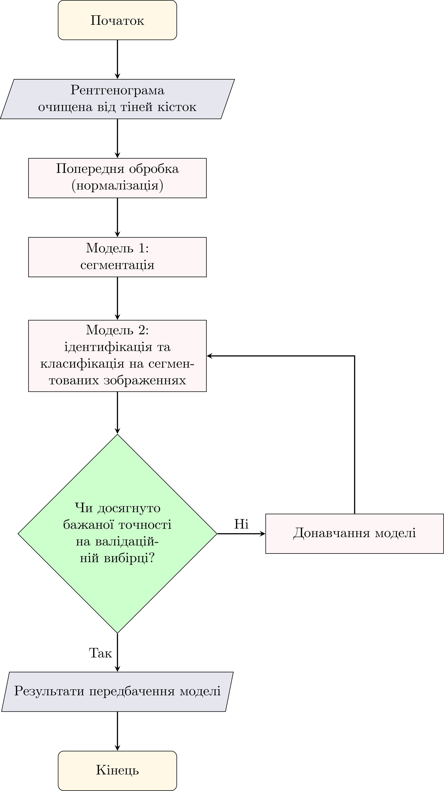]

.caption-fig[Метод попередньої обробки графiчних даних без кiсткових структур iз використанням сегментацiї дiлянок, якi мiстять цiльовi об’єкти]

---


background-image: url("./figures/pic/Unet.png")
background-size: contain
## Модель 1: сегментацiя
---

class: middle

## Модель 2: iдентифiкацiя та класифiкацiя

```python
from tensorflow import keras
from tensorflow.keras import layers

input = keras.Input(shape=(2048, 2048, 3))

x = layers.Conv2D(filters=32, kernel_size=3, activation="relu")(input)
x = layers.MaxPool2D(pool_size=2)(x)

x = layers.Conv2D(filters=64, kernel_size=3, activation="relu")(x)
x = layers.MaxPool2D(pool_size=2)(x)

x = layers.Conv2D(filters=128, kernel_size=3, activation="relu")(x)
x = layers.MaxPool2D(pool_size=2)(x)

x = layers.Conv2D(filters=256, kernel_size=3, activation="relu")(x)
x = layers.Flatten()(x)

output = layers.Dense(1, activation="sigmoid")(x)
model = keras.Model(inputs=input, outputs=output)
```
---


class: middle, 

## Метод t-SNE зменшення розмірності 

.center.width-80[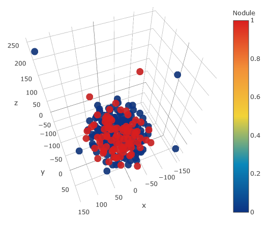]

.center.caption-fig[3D t-SNE візуалізація масок легень (червоний — з вузликами, синій — без)]

---

class: middle, 

.center.width-100[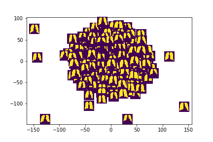]

.center.caption-fig[2D t-SNE проєкція масок легень]

---

class: middle

## Алгоритм t-SNE для фільтрації викидів у сегментованих рентгенограмах

<div class="algorithm">
<div class="algo-io">
<span class="algo-label">Вхід:</span> набір масок $X = \{x_1, x_2, \ldots, x_N\}$; параметри: $d$, $\text{Perp}(P_i)$, кількість ітерацій
</div>
<div class="algo-steps">
  <div class="algo-step"><span class="algo-num">1</span><span>Для кожної пари $x_i, x_j \in X$ обчислити умовні ймовірності $P_{j|i}$</span></div>
  <div class="algo-step"><span class="algo-num">2</span><span>Побудувати симетричну матрицю подібності $P$</span></div>
  <div class="algo-step"><span class="algo-num">3</span><span>Ініціалізувати координати $Y = \{y_1, \ldots, y_N\}$ у $d$-вимірному просторі</span></div>
  <div class="algo-block">
    <div class="algo-block-header">Повторювати до збіжності</div>
    <div class="algo-step"><span class="algo-num">4</span><span>Обчислити матрицю подібності $Q$ на основі $Y$</span></div>
    <div class="algo-step"><span class="algo-num">5</span><span>Оновити $Y$ мінімізуючи $KL(P \| Q)$</span></div>
  </div>
  <div class="algo-step"><span class="algo-num">6</span><span>Визначити ядро як щільний кластер точок $Y$</span></div>
  <div class="algo-block">
    <div class="algo-block-header">Для кожної точки $y_i \in Y$</div>
    <div class="algo-step"><span class="algo-num">7</span><span>Якщо $\min d(y_i, \text{ядро}) > \theta$ — позначити $x_i$ як викид</span></div>
  </div>
</div>
<div class="algo-io">
<span class="algo-label">Вихід:</span> очищений набір $X^* = X \setminus \{\text{викиди}\}$
</div>
</div>

---


background-image: url("./figures/pic/pipline_t_sne.png")
background-size: contain

<div style="position: absolute; right: 2em; top: 20%; transform: translateY(-50%); width: 26%; background: rgba(255,255,255,0.9); border: 1px solid #b0bec5; border-radius: 6px; padding: 0.8em; font-size: 0.7em; color: #555;  line-height: 1.5;">
  Метод попередньої обробки графiчних даних iз використанням сегментацiї дiлянок, якi мiстять цiльовi об’єкти та фiльтрацiєю викидiв за допомогою t-SNE
</div>

---
exclude: true
background-image: url("./figures/pic/fl-bb.png")
background-size: contain

<div style="position: absolute; right: 2em; top: 20%; transform: translateY(-50%); width: 26%; background: rgba(255,255,255,0.9); border: 1px solid #b0bec5; border-radius: 6px; padding: 0.8em; font-size: 0.7em; color: #555;  line-height: 1.5;">
  Метод пiдвищення ефективностi класифiкацiї у федеративному навчаннi за допомогою ансамблю опорних моделей
</div>

---

class: middle, 

.center.width-100[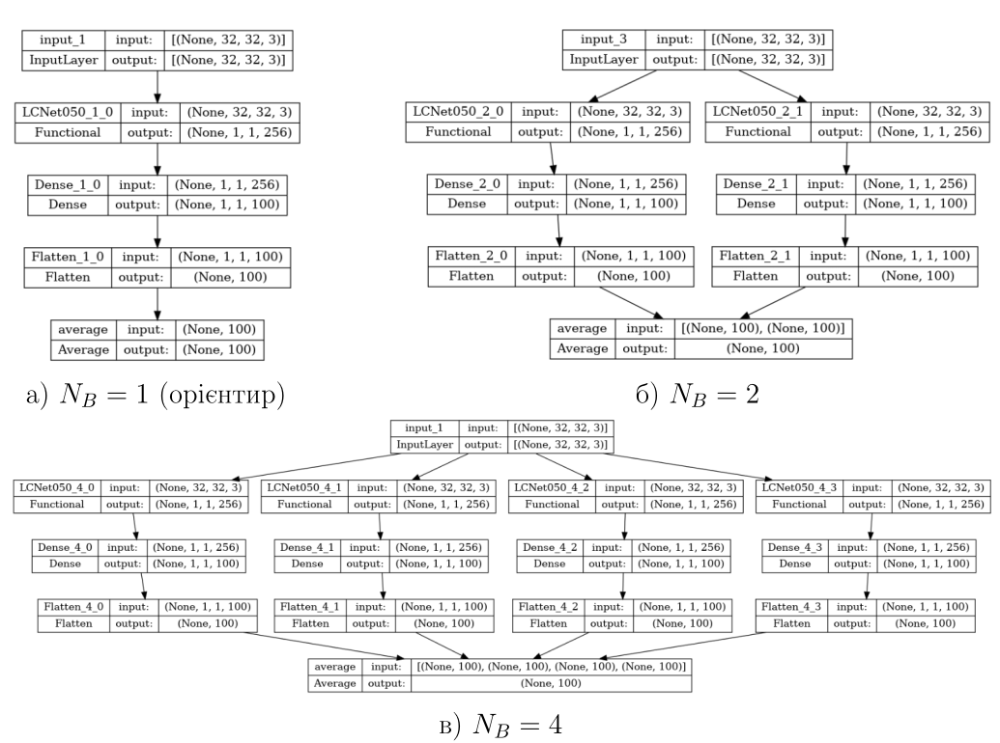]

.center.caption-fig[Метод пiдвищення ефективностi класифiкацiї у федеративному навчаннi за допомогою ансамблю опорних моделей LCNet050]

---
exclude: true
class: middle, 

.center.width-100[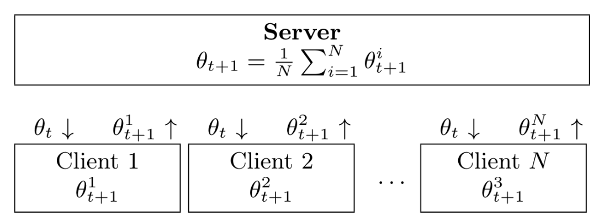]

.center.caption-fig[Стратегiя агрегацiї локальних моделей FedAvg з взаємодією «сервер-клiєнт»]

---

exclude: true
class: middle, center

<div style="position: relative; width: 90%;">
  <div style="position: relative; width: 100%; height: 70vh;">
    
    
  </div>
  <div style="margin-top: 0.1em; font-size: 0.8em; color: #555; font-style: italic;">
    <b>Рис. X.</b> Метод підвищення ефективності класифікації у федеративному навчанні за допомогою ансамблю опорних моделей LCNet050
  </div>
</div>


---


class: middle, overlay
background-image: url("./figures/pic/fl-bb.png")
background-size: contain

<div style="position: relative; z-index: 10;">
.center.width-100[]
<p style="text-align: center; font-size: 0.8em; color: #ffffff; font-weight: bold; margin-top: 0.4em;">
 Агрегацiя локальних моделей з взаємодією «сервер-клiєнт»
</p>
</div>
---

class: blue-slide, middle, center
count: false

.larger-xx[Аналіз і обговорення отриманих результатів]

---
class: middle 

.grid[
.kol-1-3[ 
.center.width-100[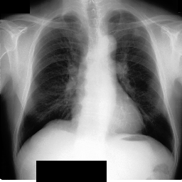]
.bold.center[а) Оригiнальний приклад, датасет №01, JSRT]

]

.kol-1-3[ 
.center.width-100[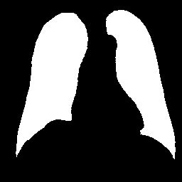]
.bold.center[б) Передбачена маска легень]

  ]

.kol-1-3[
.center.width-90[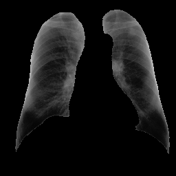]
.bold.center[в) Cегментована версiя JSRT – датасет №03]

]]

.center.caption-fig[Приклад оригінального зображення з JSRT та результату після сегментації цілової області]

---

class: middle 

.grid[
.kol-1-3[ 
.center.width-100[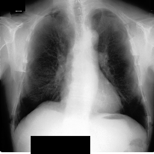]
.bold.center[а) Оригiнальний приклад, датасет №02, BSE-JSRT]

]

.kol-1-3[ 
.center.width-100[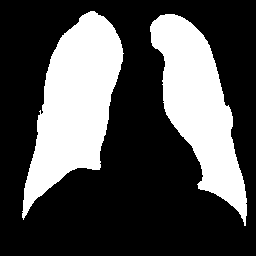]
.bold.center[б) Передбачена маска легень]

  ]

.kol-1-3[
.center.width-90[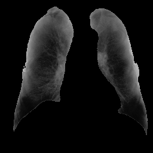]
.bold.center[в) Cегментована версiя BSE-JSRT – датасет №04]

]]

.center.caption-fig[Приклад оригінального зображення з BSE-JSRT та результату після сегментації цілової області]

---

class: middle 

.grid[
.kol-1-3[ 
.center.width-115[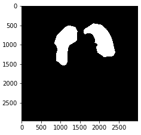]
.bold.center[а) Найбiльш несхожа маска]

]

.kol-1-3[ 
.center.width-115[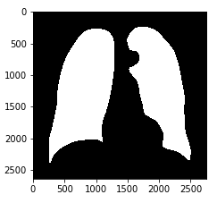]
.bold.center[б) Подібна маска]

  ]

.kol-1-3[
.center.width-100[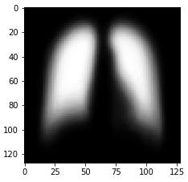]
.bold.center[в) Cередня маска]

]]

.center.caption-fig[Деякi приклади найбiльш подiбних, несхожих та усереднених масок легень]

---

class: middle

.grid[
.kol-1-3[ 
.center.width-100[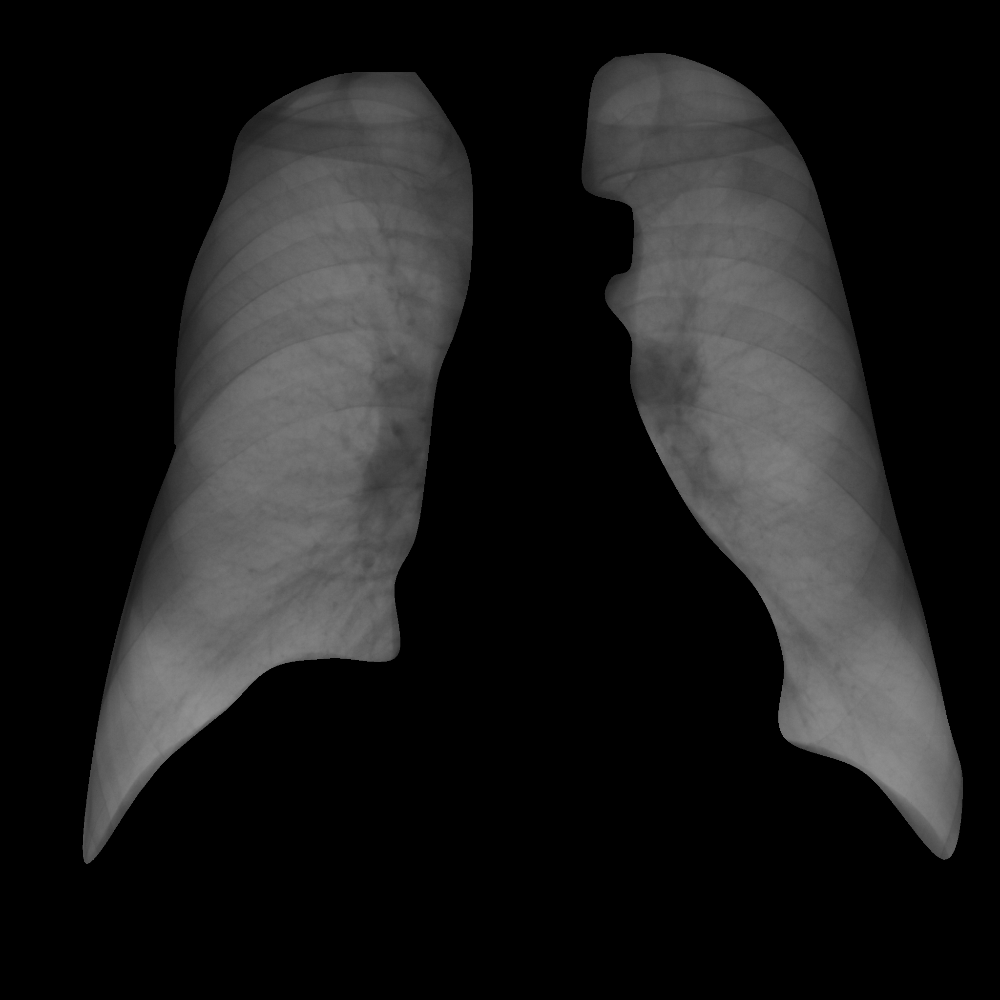]
.bold.center[а) Сегментована маска легень з датасету JSRT]

]

.kol-1-3[ 
.center.width-100[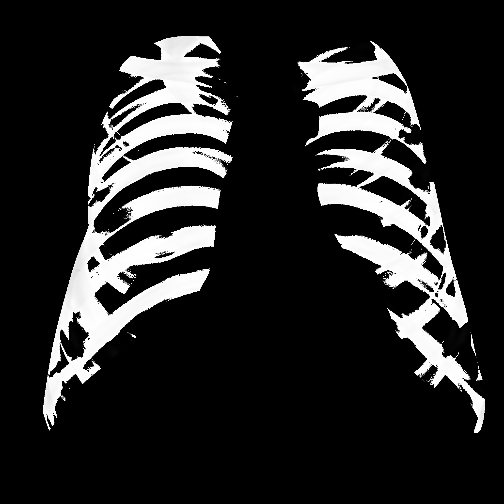]
.bold.center[б) Маска кiсток]

  ]

.kol-1-3[
.center.width-90[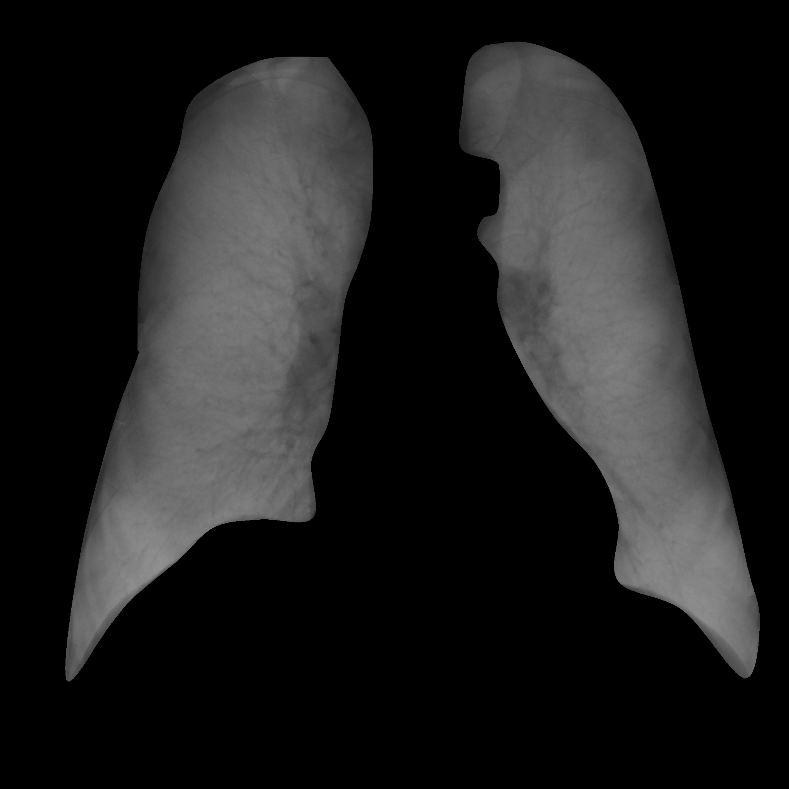]
.bold.center[в) Результуюча маска легень без кiсток]

]]

.center.caption-fig[Деякi приклади найбiльш подiбних, несхожих та усереднених масок легень]

---

class: middle 

.width-95[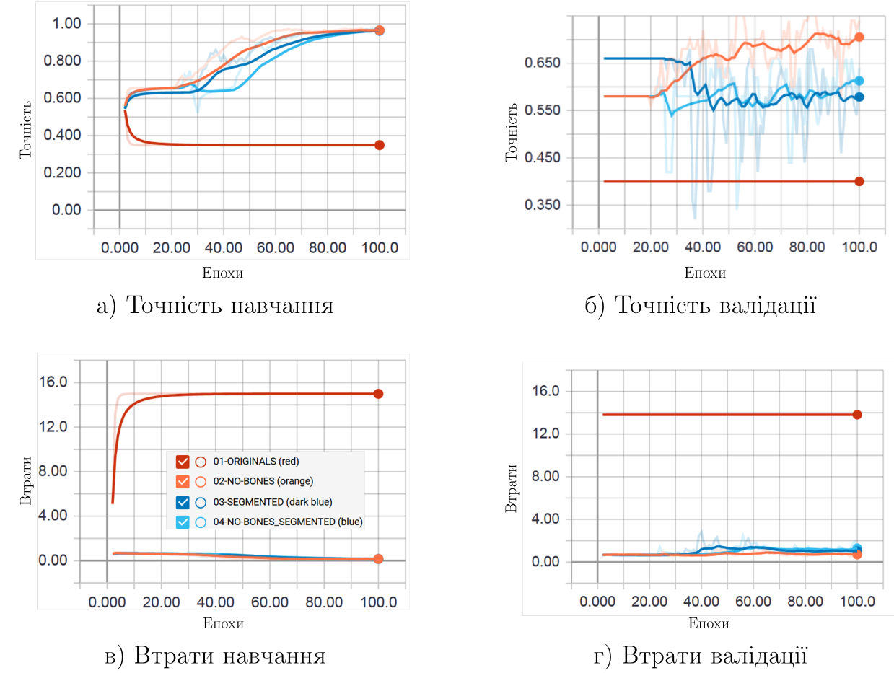]
.center.caption-fig[Точнiсть навчання а), точнiсть валiдацiї б), втрати навчання в) та втрати валiдацiї г) на наборах даних JSRT (крива 01), BSE-JSRT (крива 02), сегментованому JSRT (крива 03) та сегментованому BSE-JSRT (крива 04)]

---


class: middle 

.width-100[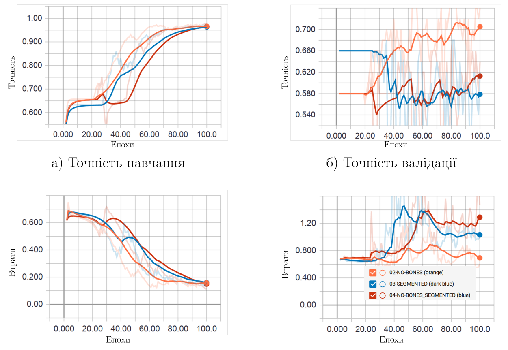]
.center.caption-fig[Точнiсть навчання а), точнiсть валiдацiї б), втрати навчання в) та втрати валiдацiї г) на наборах даних BSE-JSRT (крива 02), сегментованому JSRT (крива 03) та сегментованому BSE-JSRT (крива 04)]

---

class: middle

.grid[
.kol-1-3[ 
.center.width-100[]
.bold.center[а)]

]

.kol-1-3[ 
.center.width-100[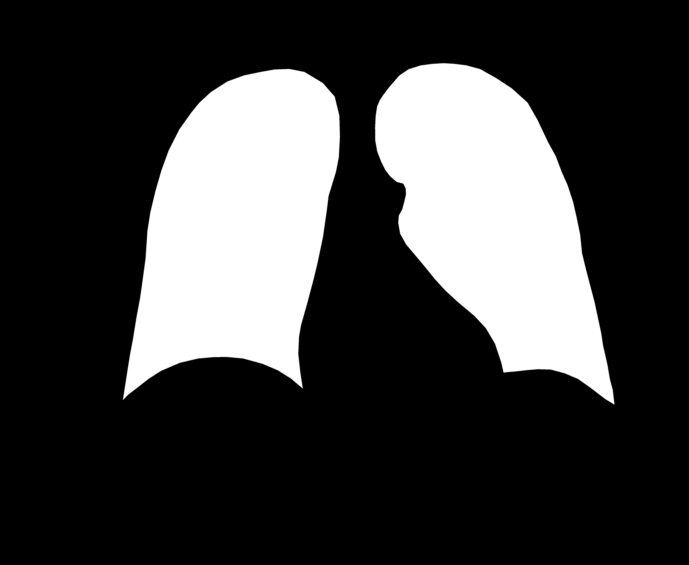]
.bold.center[б)]

  ]

.kol-1-3[
.center.width-90[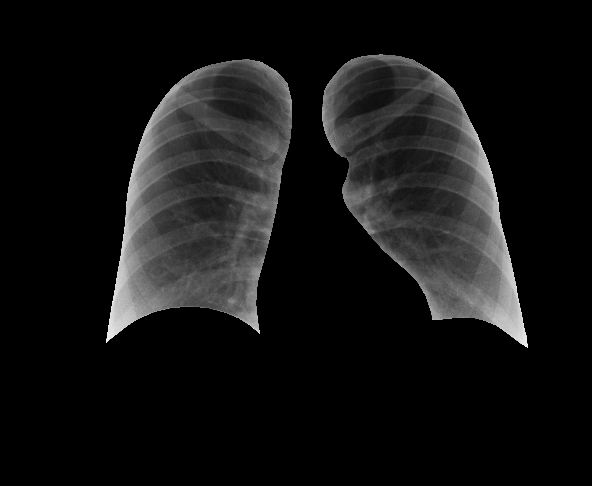]
.bold.center[в) ]

]]

.center.caption-fig[а) Оригiнальне зображення з датасету Shenzhen Hospital (SH), б) маска легень цього зображення, в) результат сегментацiї за маскою]

---

class: middle 

.width-100[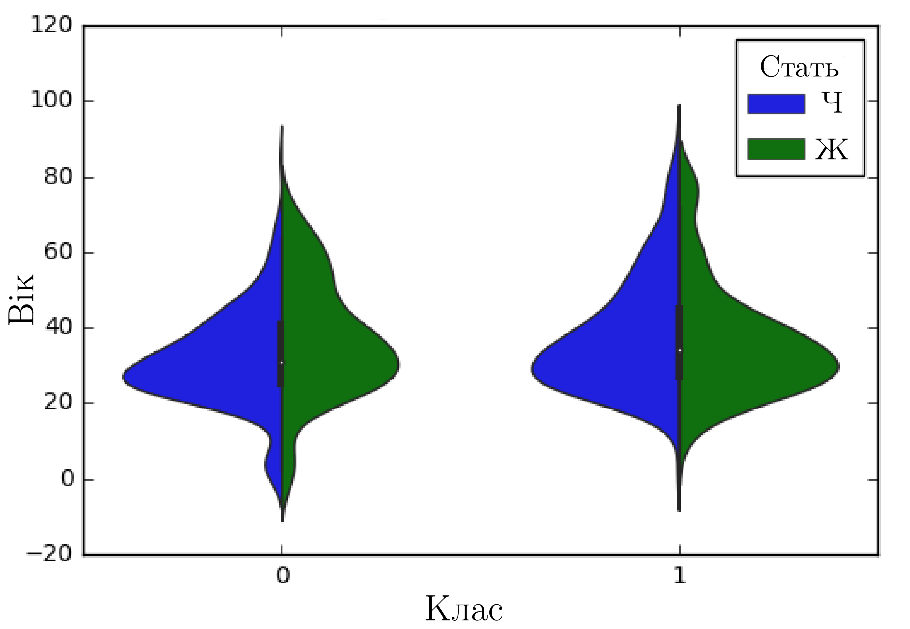]
.center.caption-fig[Комбiнований розподiл за статтю та вiком для рентгенограм без (0) та з (1) ознаками туберкульозу (SH)]

---

class: middle 

.width-100[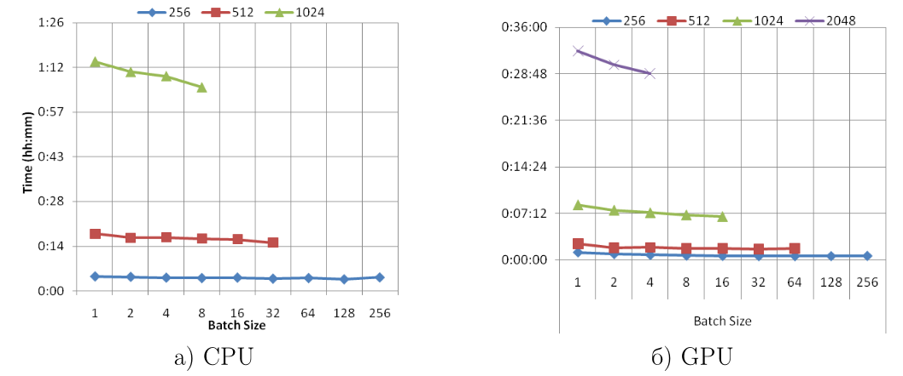]
.center.caption-fig[Час навчання моделi для різних режимів: а) CPU (Intel i7)  та б) GPU (Tesla K40c)  для рiзних розмiрiв пакету та рiзних розмiрiв зображень]

---

class: middle 

.width-100[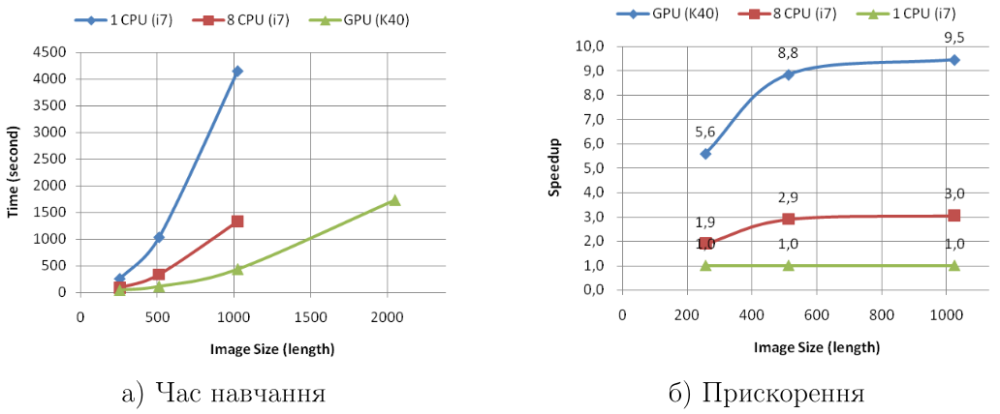]
.center.caption-fig[Час навчання моделi а) та прискорення б) для рiзних розмiрiв зображень та режимiв]

---

class: middle, center

.width-85[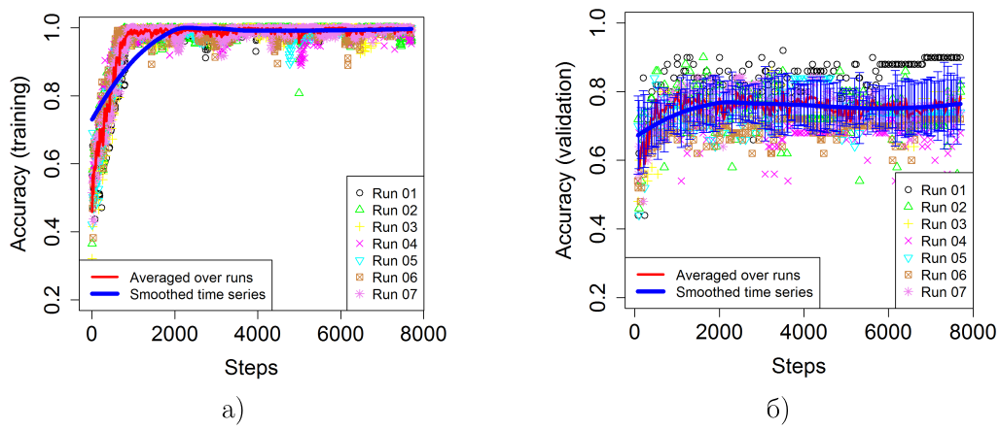]
.width-85[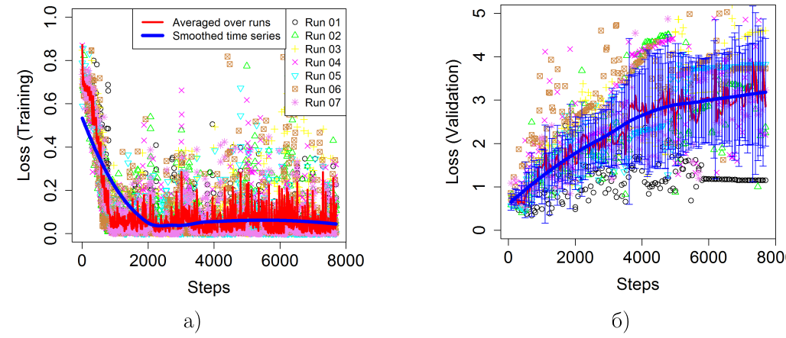]
.center.caption-fig[Значення точностi і втрат для 7 циклiв запускiв для навчання а) та валiдацiї б) моделi пiсля усереднення їх значень за циклами (червона лiнiя) та пiсля згладжування усереднених часових рядiв (синя лiнiя) за допомогою методу локально зваженої полiномiальної регресiї]

---

class: middle 

.width-100[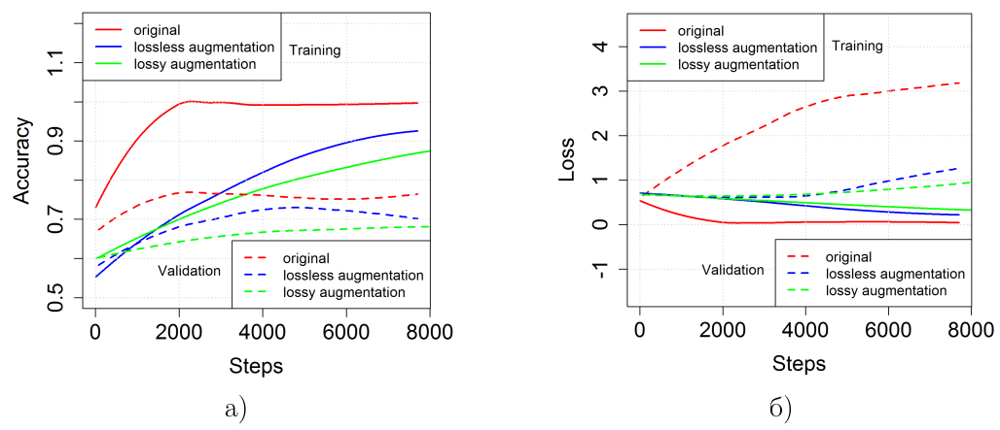]
.center.caption-fig[Усередненi та згладженi значення точностi а) та втрат б) навчання та валiдацiї на наборах даних: сегментованому наборi SH (червоний колiр), сегментованому наборi SH з розширенням даних без втрат iнформацiї (синiй колiр) та сегментованому наборi SH з розширенням даних з втратою iнформацiї (зелений колiр)]

---

class: middle, center 

.width-90[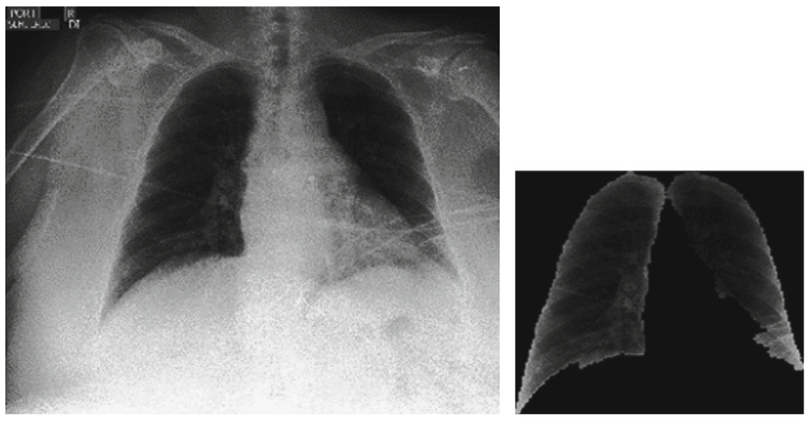]
.center.caption-fig[CheXpert: понад 224 тис. рентгенограм грудної клiтки для 65 240 пацiєнтiв з мiтками, якi охоплюють 14 дiагностичних
категорiй (патологiї та вiдсутнiсть вiдхилень). У ході експериментів застосовувалася версiя (CheXpert-v1.0-small), де всi зображення приведенi до єдиного розмiру 320×320 пiкселiв. Навчальна вибiрка налiчувала понад 200 тис. зображень, валiдацiйна – 234 знiмки вiд 200 пацiєнтiв, тестова – 500 дослiджень вiд рiзних пацiєнтiв]

---

class: middle, center 

.width-90[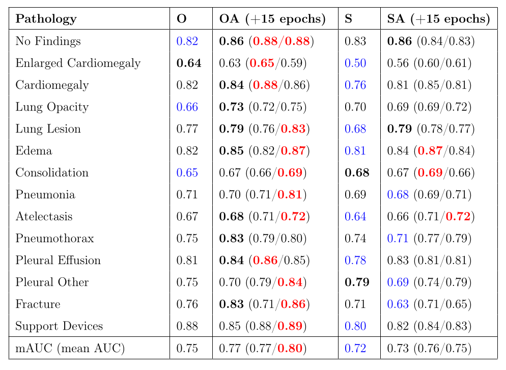]
.center.caption-fig[Значення AUC для моделей, навчених iз використанням рiзних пiдходiв. Значення у дужках отриманi пiсля додаткового навчання протягом 15 епох (2-й / 3-й запуск)]

---

exclude: true
class: middle, center

.smaller-x[
| Pathology | O | OA (+15 epochs) | S | SA (+15 epochs) |
|:---|:---:|:---:|:---:|:---:|
| No Findings | .blue[0.82] | **0.86** (.red[**0.88/0.88**]) | 0.83 | **0.86** (0.84/0.83) |
| Enlarged Cardiomegaly | **0.64** | 0.63 (.red[**0.65**]/0.59) | .blue[0.50] | 0.56 (0.60/0.61) |
| Cardiomegaly | 0.82 | **0.84** (.red[**0.88**]/0.86) | .blue[0.76] | 0.81 (0.85/0.81) |
| Lung Opacity | .blue[0.66] | **0.73** (0.72/0.75) | 0.70 | 0.69 (0.69/0.72) |
| Lung Lesion | 0.77 | **0.79** (0.76/.red[**0.83**]) | .blue[0.68] | **0.79** (0.78/0.77) |
| Edema | 0.82 | **0.85** (0.82/.red[**0.87**]) | .blue[0.81] | 0.84 (.red[**0.87**]/0.84) |
| Consolidation | .blue[0.65] | 0.67 (0.66/.red[**0.69**]) | **0.68** | 0.67 (.red[**0.69**]/0.66) |
| Pneumonia | 0.71 | 0.70 (0.71/.red[**0.81**]) | 0.69 | .blue[0.68] (0.69/0.71) |
| Atelectasis | 0.67 | **0.68** (0.71/.red[**0.72**]) | .blue[0.64] | 0.66 (0.71/.red[**0.72**]) |
| Pneumothorax | 0.75 | **0.83** (0.79/0.80) | 0.74 | .blue[0.71] (0.77/0.79) |
| Pleural Effusion | 0.81 | **0.84** (.red[**0.86**]/0.85) | .blue[0.78] | 0.83 (0.81/0.81) |
| Pleural Other | 0.75 | 0.70 (0.79/.red[**0.84**]) | **0.79** | .blue[0.69] (0.74/0.79) |
| Fracture | 0.76 | **0.83** (0.71/.red[**0.86**]) | 0.71 | .blue[0.63] (0.71/0.65) |
| Support Devices | 0.88 | 0.85 (0.88/.red[**0.89**]) | .blue[0.80] | 0.82 (0.84/0.83) |
| **mAUC** | 0.75 | 0.77 (0.77/.red[**0.80**]) | .blue[0.72] | 0.73 (0.76/0.75) |
]

---

class: middle, center 

.width-80[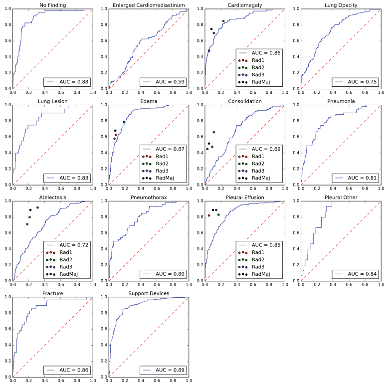]

???
ROC-крiвi та значення AUC для моделi, навченої на оригiнальному наборi даних iз застосуванням аугментацiї (OA). По
вертикальнiй осi вiдкладено значення показника iстиннопозитивних результатiв (True Positive Rate, TPR), а по горизонтальнiй – частку
хибнопозитивних результатiв (False Positive Rate, FPR). Кольоровi точки вiдображають данi трьох експертiв радiологiв (Rad1, Rad2,
Rad3) та їхню бiльшiсть голосiв (RadMaj) для порiвняння за вiдповiдними захворюваннями

---

class: middle, center 

.width-100[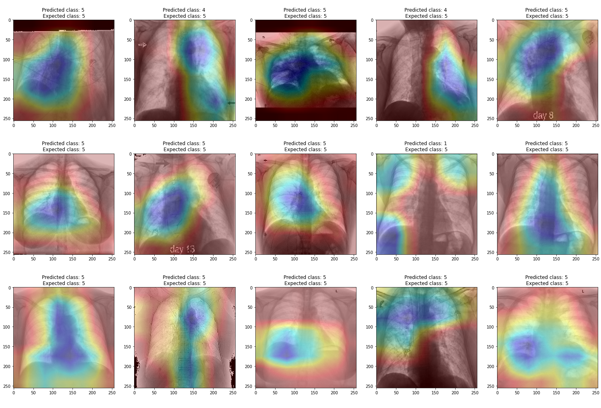]
.center.caption-fig[Вiзуалiзацiя теплових мап для тестових зображень]

---

class: middle, center 

.width-100[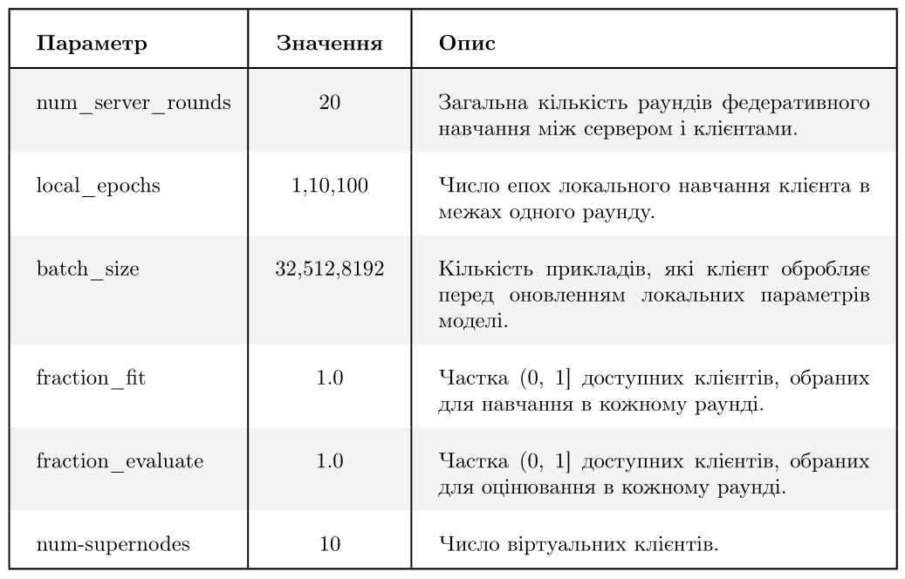]
.center.caption-fig[Основнi параметри FedAvg та їхнi значення, використанi в експериментах для ансамблю опорних моделей у
федеративному навчаннi]

---

class: middle, center 

.width-100[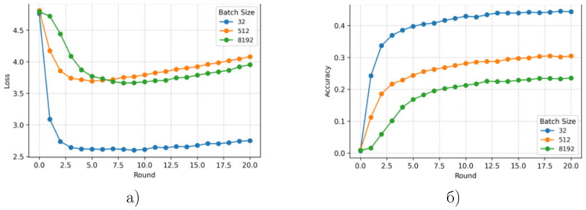]
.center.caption-fig[Динамiка змiни валiдацiйних втрат а) та точностi б) LCNet050 ($N\_{MB} = 1$) для рiзних розмiрiв пакету $N_b \in$ {32, 512, 8192}]

---

class: middle, center 

.width-90[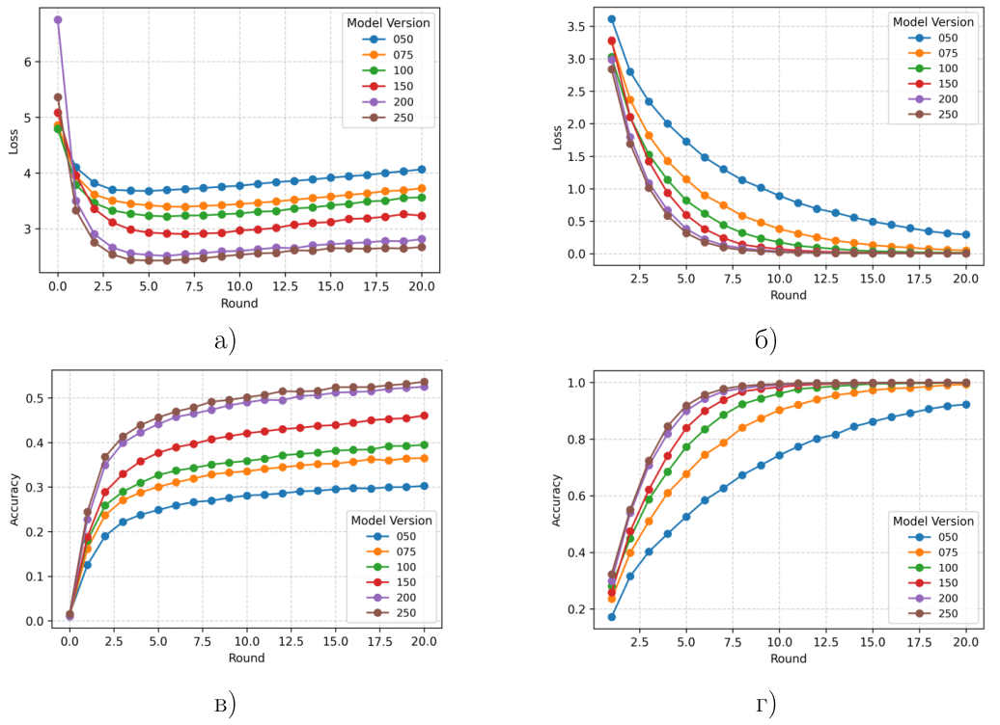]
.center.caption-fig[Типовi кривi валiдацiйних втрат (а, б) та валiдацiйної точностi (в, г) для рiзних версiй архiтектури LCNet з кiлькiстю опорних моделей $N\_{MB} = 1$ для розмiру пакету $N\_b = 512$. Графiки (а, в) вiдображають результати для метрик централiзованої валiдацiї, а (б, г) – для метрик федеративного навчання. У легендi наведено суфiкси для версiй LCNet]

---

class: middle, center 

.width-100[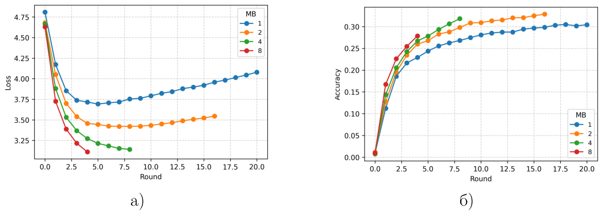]
.center.caption-fig[Типовi кривi валiдацiйних втрат а) та валiдацiйної точностi б) для архiтектури LCNet050 з рiзною кiлькiстю опорних моделей
$N\_{MB} \in \{1, 2, 4, 8\}$  для розмiру пакету $N\_b = 32$]

---

class: middle, center 

.width-100[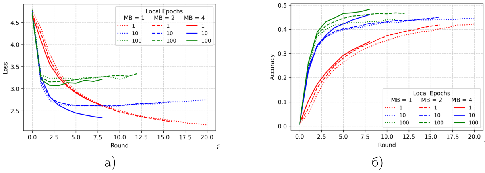]
.center.caption-fig[Типовi кривi валiдацiйних втрат а) та валiдацiйної точностi б) для архiтектури LCNet050 з рiзною кiлькiстю опорних моделей
$N\_{MB} \in \{1, 2, 4\}$, кiлькiстю локальних епох $N\_{le} \in \{1, 10, 100\}$  для розмiру пакету $N\_b = 32$]

---

class: middle, 

Максимальнi значення точностi досягнутi для рiзної кiлькостi локальних епох $N\_{le}$ та кiлькостi опорних моделей $N\_{MB}$. Жирним шрифтом видiлено максимальне значення точностi для конкретного $N\_{le}$ серед усiх розглянутих опорних моделей $N\_{MB}$ 

.width-100[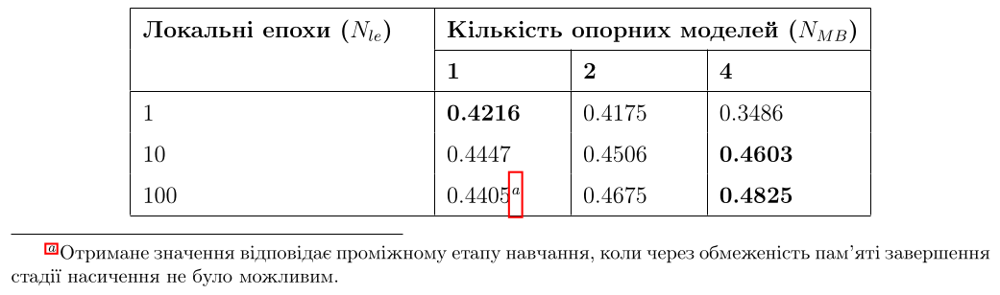]

---

# Висновки

.smaller-xm[
1. Розроблено та адаптовано методи глибинного навчання для задач iдентифiкацiї, класифiкацiї та семантичної сегментацiї об’єктiв на 2D рентгенограмах. Використання сегментацiї анатомiчних структур та вилучення тiней кiсток забезпечило покращення результатiв дiагностики патологiчних станiв легень.

1. Вперше запропоновано технологiю попередньої обробки 2D рентгенограм на основi глибоких нейронних мереж типу кодер-декодер для сегментацiї дiлянок, що мiстять цiльовi об’єкти. Це дозволило пiдвищити ефективнiсть подальшого навчання моделей, зменшити вплив артефактiв та покращити точнiсть класифiкацiї.

1. Розроблено метод зменшення розмiрностi даних на основi t-SNE, що дозволяє виключати викиди серед розподiлу сегментованих масок та пiдвищувати ефективнiсть моделей глибинного навчання у задачi класифiкацiї патологiй легень на основi 2D рентгенограм.

1. Запропоновано пiдхiд для покращення ефективностi класифiкацiї у рамках федеративного навчання на основi ансамблю опорних моделей.
Використання ансамблю моделей з низькою обчислювальною складнiстю дозволило покращити результати узагальнення моделi. Оптимiзацiя таких гiперпараметрiв як кiлькiсть моделей в ансамблi, кiлькiсть локальних епох та розмiр пакету даних додатково дозволяє пiдвищити
ефективнiсть запропонованого пiдходу.

1. Проведено експериментальну оцiнку ефективностi розроблених методiв, яка показала, що поєднання сегментацiї, вилучення тiней кiсток, зменшення розмiрностi даних, аугментацiя даних та використання ансамблю опорних моделей у рамках федеративного навчання дозволяє покращити узагальнювальну здатнiсть та надiйностi систем для автоматизованого аналiзу вiзуальних даних, зокрема для комп’ютерної дiагностики захворювань з продуктивнiстю, яка спiвставна з рiвнем лiкарiв-експертiв.

]


???
У дисертацiйному дослiдженнi розв’язане актуальне наукове завдання, яке спрямоване на пiдвищення ефективностi та надiйностi автоматизованих
методiв аналiзу вiзуальних даних, зокрема таких, що представленi у виглядi рентгенограм, шляхом створення та оптимiзацiї методiв i моделей глибинного машинного навчання для iдентифiкацiї, класифiкацiї та семантичної сегментацiї об’єктiв. У результатi було отримано такi науковi i практичнi результати:

1. Проведено аналiз сучасних методiв машинного та глибинного навчання, якi використовуються для задач комп’ютерного зору. Встановлено
переваги та недолiки розглянутих пiдходiв, що дозволило сформулювати шляхи для вдосконалення ефективностi дiагностики легеневих
захворювань на основi 2D рентгенограм. Проведений аналiз показав високий потенцiал методiв глибинного навчання для досягнення точностi дiагностики на рiвнi лiкарiв-експертiв, зменшення навантаження на медичний персонал та прискорення обробки великих обсягiв медичних
даних. Виявлено ключовi фактори, що обмежують широке впровадження штучного iнтелекту у клiнiчну практику, зокрема потреба у великих
та збалансованих наборах даних, варiативнiсть апаратiв i протоколiв отримання знiмкiв, а також необхiднiсть забезпечення iнтерпретованостi результатiв для лiкарiв.

---

exclude: true
# Висновки

1. Запропоновано пiдхiд для покращення ефективностi класифiкацiї у рамках федеративного навчання на основi ансамблю опорних моделей.
Використання ансамблю моделей з низькою обчислювальною складнiстю дозволило покращити результати узагальнення моделi. Оптимiзацiя таких гiперпараметрiв як кiлькiсть моделей в ансамблi, кiлькiсть локальних епох та розмiр пакету даних додатково дозволяє пiдвищити
ефективнiсть запропонованого пiдходу.

1. Проведено експериментальну оцiнку ефективностi розроблених методiв, яка показала, що поєднання сегментацiї, вилучення тiней кiсток, зменшення розмiрностi даних, аугментацiя даних та використання ансамблю опорних моделей у рамках федеративного навчання дозволяє покращити узагальнювальну здатнiсть та надiйностi систем для автоматизованого аналiзу вiзуальних даних, зокрема для комп’ютерної дiагностики захворювань з продуктивнiстю, яка спiвставна з рiвнем лiкарiв-експертiв.

---


exclude: true
class:  middle,

# првл Лол
## KJk dsnkj 
.quote[
Щоразу, коли наукова .bold[стаття представляє певні дані], їх супроводжують межі похибки — скромне, але промовисте нагадування про те, що жодне знання не є повним або досконалим. Це калібрування того, наскільки ми довіряємо тому, що, як нам здається, ми знаємо.
]
.quote-cite[— Карл Саган]

---

class:  middle, center
count: false

.larger-xxx[Дякую за увагу!

⌛] 